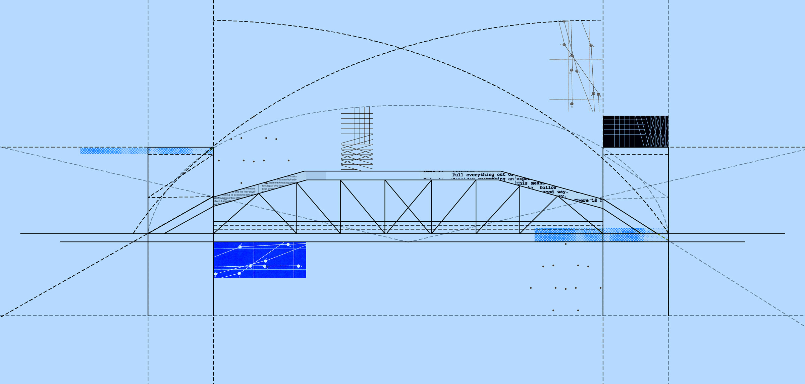

# Bridging

<figure><figcaption>
source: <a href="https://www.hiro.so/blog/understanding-blockchain-bridges-a-key-to-interoperability-in-web3">Hiro Blog</a>
</figcaption></figure>

A blockchain bridge is a protocol or mechanism that serves as a connection between different blockchains, allowing for the transfer of tokens and data between them. Bridges enable the seamless transfer of data and assets between disparate blockchain networks. They break down the silos of individual blockchains and unlock the full potential of a permissionless, borderless Web3.

#### Explore the different bridges available with Stacks

<table data-card-size="large" data-view="cards"><thead><tr><th></th><th></th><th data-hidden data-card-target data-type="content-ref"></th></tr></thead><tbody><tr><td><h4>USDCx</h4></td><td>Learn how USDC can flow to and from the bitcoin layer 2.</td><td><a href="usdcx/">usdcx</a></td></tr></tbody></table>
