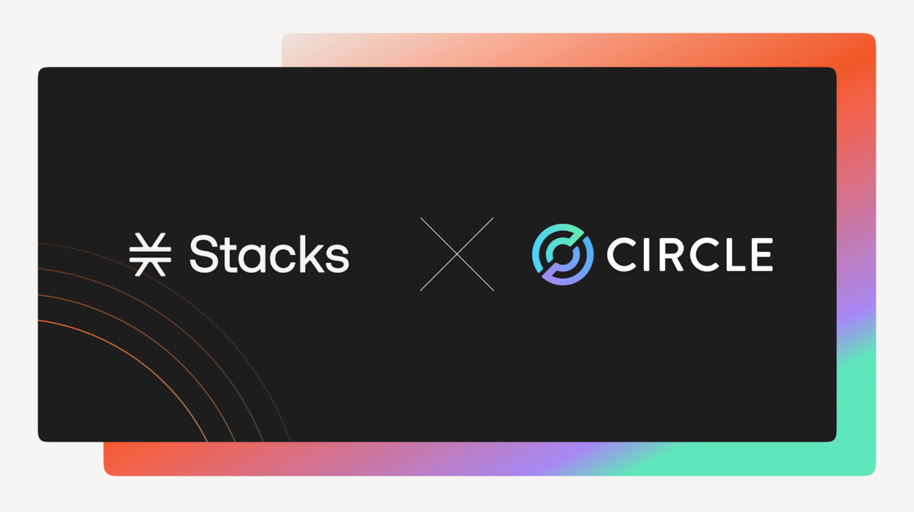

# USDCx

<figure><figcaption></figcaption></figure>


Developer support for integrating USDCx bridging into applications will be available via Circle’s Bridge Kit SDK in Q1 2026.


Stacks now has a fully USDC-backed stablecoin that plugs directly into Circle’s multichain ecosystem and brings stable, interoperable dollar liquidity to Bitcoin’s leading Layer 2.

### What is USDCx?

USDCx is a 1:1 USDC-backed stablecoin issued through Circle xReserve and native to Stacks. It will exist as a SIP-010 token on Stacks.&#x20;

Circle's xReserve provides cryptographic attestations for deposits and minting, while Circle Gateway and CCTP handle cross-chain movement. The result is USDC on Stacks without third-party bridges, wrapped assets, or fragmented liquidity.


For more info on xReserve, check out the dedicated Circle docs [here](https://developers.circle.com/xreserve).


### Discover more of USDCx

<table data-view="cards"><thead><tr><th></th><th data-hidden data-card-target data-type="content-ref"></th></tr></thead><tbody><tr><td><h4>Operations</h4></td><td><a href="operations.md">operations.md</a></td></tr><tr><td><h4>Contracts</h4></td><td><a href="contracts/">contracts</a></td></tr><tr><td><h4>Bridge App</h4></td><td><a href="bridge-app/">bridge-app</a></td></tr><tr><td><h4>Security</h4></td><td><a href="/broken/pages/lpi1fDfEzVNhJIl6VUWP">Broken link</a></td></tr><tr><td><h4>FAQ</h4></td><td><a href="faq.md">faq.md</a></td></tr></tbody></table>

***

### Additional Resources

* \[[Stacks Blog](https://www.stacks.co/blog/stacks-circle-xreserve-usdc)] Stacks to integrate Circle xReserve for USDC interoperability&#x20;
