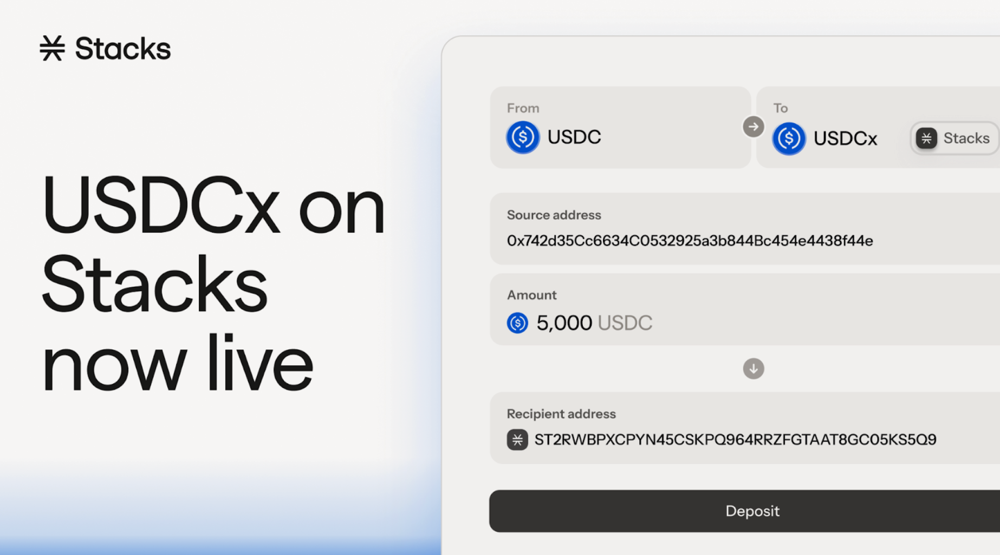

# USDCx Bridge App

<figure><figcaption>
<a href="http://bridge.stacks.co/">https://bridge.stacks.co</a>
</figcaption></figure>

The USDCx Bridge app is maintained by Stacks Labs and is powered by Circle xReserve.

Acquire USDCx through the [official bridge app](https://bridge.stacks.co/) or migrate your aeUSDC into USDCx to take advantage of better liquidity and improved trust assumptions.&#x20;

At launch, the USDCx bridge on Stacks supports transfers between Ethereum and Stacks. The first aeUSDC–USDCx liquidity pool will be available on Bitflow in early January.

Support for additional Circle / CCTP-compatible networks is on the roadmap and will roll out in Q1 2026, enabling broader interoperability across Circle’s multichain USDC ecosystem.
