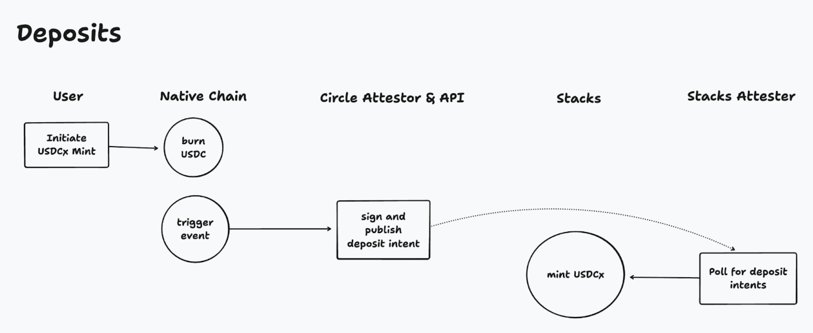
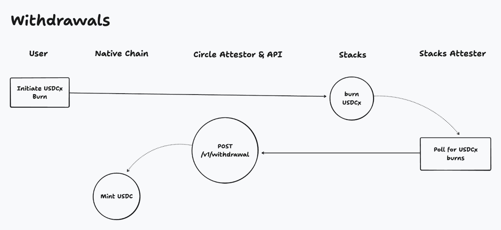

# Operations

Let's walkthrough each of the operations that enable the bridging of USDC in and out of Stacks.

### Definitions

* **USDC**: Refers to native-chain USDC locked on the source chain that secures USDC-backed token at a 1-to-1 ratio.
* **xReserve smart contract**: Circle deploys and audits the xReserve contract on source blockchains such as Ethereum. It holds USDC deposited by users in reserve when a USDC-backed token is minted on Stacks
* **xReserve attestation service**: Operated by Circle. They monitor USDC deposits into the xReserve smart contract and sign deposit attestations. They also verify withdrawal attestations to release USDC.
* **Stacks attestation service**: Operated by Stacks. They monitor signed deposit attestations to trigger minting of USDCx. In addition, they monitor burns of USDC-backed tokens to sign burn intents which are then forwarded to Circle's xReserve attestation service.
* **USDCx**: A SIP-010 token on Stacks fully backed by USDC.

### Deposits

<figure><figcaption></figcaption></figure>

For bridging native USDC into the Stacks network.

1. A user deposits USDC from their wallet app into an xReserve smart contract, managed by Circle, on the Ethereum network.
2. The xReserve contract emits a deposit event and locks the funds, holding them in reserve.
3. The xReserve attestation service, managed by Circle, generates and signs a deposit attestation.
4. The Stacks network's attestation service fetches the signed deposit attestation.
5. The Stacks network mints USDC-backed tokens, USDCx, and emits a mint event.
6. The Stacks' USDCx token contract deposits the newly minted USDC-backed tokens into the user’s Stacks wallet.

After completing the deposit process, the user receives an equivalent amount of USDC-backed tokens on Stacks.

### Withdrawals

<figure><figcaption></figcaption></figure>

For withdrawing native USDC from the Stacks network.

1. A user requests to burn USDC-backed tokens on Stacks and to withdraw USDC on the destination network.
2. The Stacks USDCx token contract burns their USDC-backed tokens and emits a burn event.
3. The Stacks network's attestation service generates and signs a burn intent offchain.
4. The Stacks network's attestation service passes the burn intent and signature to xReserve, managed by Circle.
5. xReserve verifies the burn and issues a withdrawal attestation.
6. xReserve releases USDC to the user’s wallet on the destination network.

After completing the withdrawal process, the user receives USDC on the destination network.
