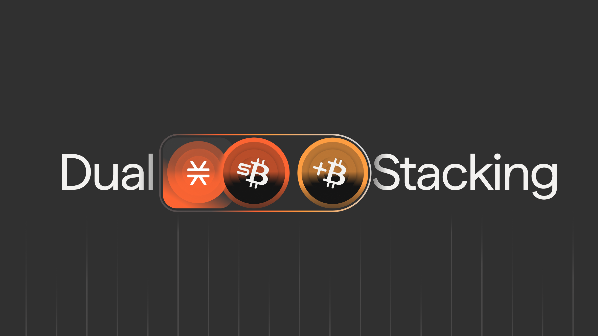
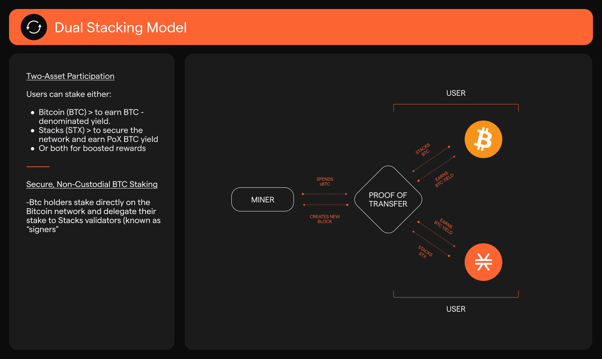

# Dual Stacking

<figure><figcaption></figcaption></figure>


Check out the official blog announcement of Dual Stacking [here](https://www.stacks.co/blog/dual-stacking-launches-on-stacks).



Dual Stacking contracts will be upgraded on Dec 15. This upgrade enables more flexible reward parameters and allows users to view their sBTC holdings and corresponding rewards within the Dual Stacking app.

1. If you enrolled in Dual Stacking you'll be moved over automatically with no action needed.
2. If you did not enroll in the web app but were receiving Dual Stacking rewards through a participating app, you need to enroll on the web app.

To check your enrollment status go to [app.stacks.co](https://app.stacks.co/).


Dual Stacking enables Bitcoin holders to earn Bitcoin-denominated rewards through Stacks' [Proof of Transfer](../stacks-101/proof-of-transfer.md) consensus. Rewards are paid in [sBTC](../sbtc/).

<figure><figcaption></figcaption></figure>

Dual Stacking is the only way to earn Bitcoin rewards while stacking Bitcoin. Other blockchains pay rewards in their native token (ETH, SOL, etc.). They have no mechanism to generate real Bitcoin. **Stacks' Proof of Transfer (PoX)** is the architectural difference that makes Bitcoin earning Bitcoin rewards possible.\
\
As more BTC enters the Stacks network, rates will adjust. But the multiplier effect remains: pairing STX with your BTC and deploying sBTC into DeFi always amplify your returns.

***

Additional Resources

* \[[Stacks YT](https://youtu.be/bfWPr_qMQmc?si=A9R2OKRHZ-N6Uwhe)] Dual Stacking Explained: Earn Bitcoin on Your Bitcoin
