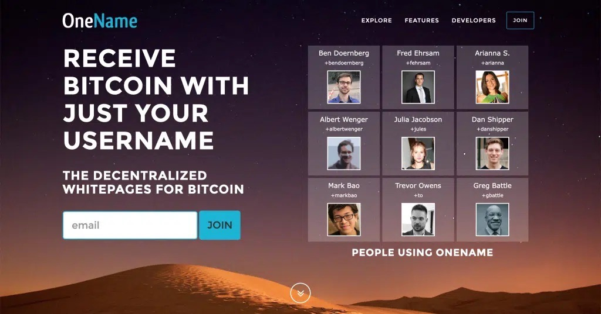

# History of BNS

#### Origins on Namecoin (2014)

The Bitcoin Name System (BNS) traces its roots back to 2014, when it began as a naming and identity layer built on top of Namecoin through the OneName project.

<figure><figcaption></figcaption></figure>

The idea was simple but powerful: allow users to register globally unique, human-readable names that were cryptographically tied to private keys. Early adopters claimed names in formats like `u/ryan`, using them as portable digital identities. However, Namecoin’s limitations—including spam, weaker security guarantees, and slower confirmations—made long-term scalability difficult.

#### Migration to Bitcoin (2015)

In 2015, the project migrated to the Bitcoin blockchain itself, anchoring the `.id` namespace by burning approximately 40 BTC in a public commitment. This move dramatically increased the security model by leveraging Bitcoin’s durability and decentralization. Name registrations were recorded directly in Bitcoin transactions, often using `OP_RETURN`, while richer state data lived off-chain. This hybrid approach allowed BNS to inherit Bitcoin’s security while still supporting flexible identity metadata.

#### Stacks Era (2021)

The next major chapter began in 2021 with the launch of Stacks. With Stacks introducing smart contract functionality anchored to Bitcoin, BNS was deployed as a smart contract at the genesis of Stacks 2.0. All prior BNS names were migrated over, preserving ownership history while enabling more expressive on-chain logic. Names such as `.btc` quickly gained popularity, and BNS evolved into a core identity primitive within the Stacks ecosystem. Each name became globally unique and strongly owned by a private key, with zone files enabling up to roughly 40KB of off-chain data for profiles, address mappings, and decentralized identifiers (see BNSv2 changes below). BNS supported both fully on-chain names and off-chain subdomains anchored to blockchain state, giving developers flexibility in how they structured identity systems.



#### **BNS has evolved into a cornerstone of the Bitcoin ecosystem.**

BNS names have generated substantial marketplace activity, with sales volume reaching 1.5 million STX (an estimated $2 million). The launch of the BNS marketplace on [Gamma.io](http://gamma.io) in October 2022 gave the community a dedicated space to buy, sell, and trade names. This has helped to solidify BNS' status as a leader in the decentralized domain market.

In February 2024, BNS celebrated its 10th anniversary, marking a decade of progress in decentralised naming and identity on the Bitcoin blockchain.

#### Limitations of BNS V1

The original implementation of BNS on Stacks, often referred to as V1, worked reliably but had structural constraints. A single address could maintain only one primary name at a time, which limited composability and made trading or collecting names more cumbersome. Additionally, names were not implemented as SIP-09 NFTs, which meant they did not automatically interoperate with the broader NFT tooling ecosystem. Over time, as Stacks matured and NFT standards solidified, the community began pushing for a more flexible and interoperable redesign.

#### Evolution Toward BNS V2

That redesign materialized in September 2024 as BNSv2. The migration from BNSv1 to BNSv2 saw names airdropped to the account that owned them as of the migration snapshot on September 11, 2024. Users didn’t need to do anything...their BNSv2 name simply appeared in their wallet. The BNSv1 contract still exists on-chain but changes to names via V1 are NOT reflected in V2 and vice versa.

The new implementation fundamentally re-architected how names are represented and managed. Most notably, every top-level name is now a SIP-09 compliant NFT. This change allows BNS names to plug directly into wallets, marketplaces, and smart contracts without requiring custom handling logic. It also means names behave like standard digital assets: they can be transferred, listed, escrowed, or integrated into DeFi protocols with minimal friction.

BNSv2 also removed the single-name limitation, enabling addresses to own multiple names simultaneously. This seemingly simple change dramatically improves usability and unlocks more complex application patterns, from identity portfolios to namespace-based branding strategies. Namespaces themselves have become more flexible under V2. Developers or communities can create either unmanaged namespaces that operate permissionlessly or managed namespaces with designated authorities who can define pricing rules, verification requirements, or other constraints. Managed namespaces are controlled by a **contract principal** (not a standard wallet), and that this manager can be permanently frozen for full decentralization. This flexibility opens the door for curated identity layers, branded ecosystems, and experimental naming economies.

<strong>What happens to BNSv1?</strong>

The BNSv1 smart contract will continue to exist. But any changes made to names via the BNSv1 contract won't be reflected in BNSv2 and vice versa going forward.

The registration flow in BNSv2 continues to use a preorder-and-reveal mechanism to prevent front-running, where a salted hash of the name is committed before the actual name is revealed. Zonefiles remain part of the architecture, allowing names to reference external data such as wallet addresses, profiles, or decentralized identity records. But V2 zonefiles are fundamentally different from V1. In V1, zonefiles were off-chain data replicated via the Atlas network. In V2, zonefiles are stored on-chain in a separate zonefile-resolver contract. Because names are now NFTs, they integrate more naturally with marketplaces and infrastructure across the Stacks ecosystem, while still inheriting Bitcoin’s security guarantees through Stacks’ anchoring model.

Today, BNSv2 stands as both an identity system and a digital asset framework built on Stacks. It preserves the original vision of globally unique, user-owned names secured by Bitcoin, while modernizing the architecture to align with NFT standards, multi-asset ownership, and programmable namespace management.

***

#### Additional Resources

* A deeper historical walkthrough of BNS: [https://mythbtc.xyz/bns-history/](https://mythbtc.xyz/bns-history/)
