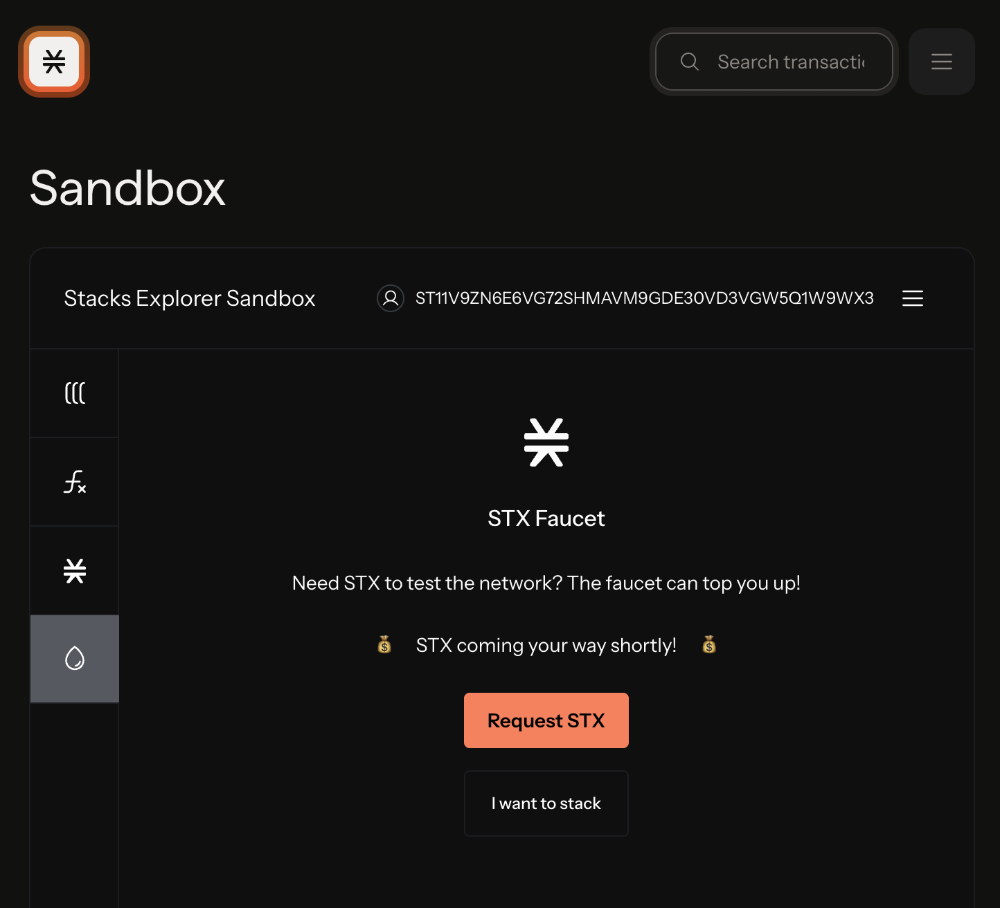

# Mainnet and Testnets

<figure><figcaption></figcaption></figure>

Stacks has both a mainnet and a testnet for different purposes. Mainnet and testnet are two completely different public networks and tokens cannot be transferred between one or the other.

### Tech Specs for Mainnet and Testnet

<table><thead><tr><th width="215.19140625"></th><th width="244.26953125">Mainnet</th><th>Testnet</th></tr></thead><tbody><tr><td>Chain ID</td><td><code>1</code></td><td><code>2147483648</code></td></tr><tr><td>Transaction Version</td><td><code>0</code></td><td><code>128</code></td></tr><tr><td>Magic Bytes</td><td><code>X2</code></td><td><code>T2</code></td></tr><tr><td>Explorer</td><td><a href="https://explorer.hiro.so/">https://explorer.hiro.so/</a></td><td><a href="https://explorer.hiro.so/?chain=testnet">https://explorer.hiro.so/?chain=testnet</a></td></tr><tr><td>Stacks API Base URL</td><td><a href="https://api.hiro.so">https://api.hiro.so</a></td><td><a href="https://api.hiro.so">https://api.testnet.hiro.so</a></td></tr><tr><td>Address Format / Version</td><td><strong>SP</strong>3B108...2DNJA0 / <code>22</code></td><td><strong>ST</strong>3B108P...EQEZY5 / <code>26</code></td></tr><tr><td>Multisig Format / Version</td><td><strong>SM</strong>3RWH...5X9DXM / <code>20</code></td><td><strong>SN</strong>8NKFP...2NAQJA / <code>21</code></td></tr><tr><td>Genesis Block</td><td><a href="https://explorer.hiro.so/block/0x6b2c809627f2fd19991d8eb6ae034cb4cce1e1fc714aa77351506b5af1f8248e?chain=mainnet">Block #1</a></td><td><a href="https://explorer.hiro.so/block/0xc9938007fe5f8cc312d782349a6cfbaee7598e08acc4f4da31c876a4b16d4153?chain=testnet">Block #1</a></td></tr><tr><td>sBTC contract</td><td><a href="https://explorer.hiro.so/token/SM3VDXK3WZZSA84XXFKAFAF15NNZX32CTSG82JFQ4.sbtc-token?chain=mainnet">SM3VDXK3WZZSA84XXFKAFAF15NNZX32CTSG82JFQ4.sbtc-token</a></td><td><a href="https://explorer.hiro.so/txid/ST1F7QA2MDF17S807EPA36TSS8AMEFY4KA9TVGWXT.sbtc-token?chain=testnet">ST1F7QA2MDF17S807EPA36TSS8AMEFY4KA9TVGWXT.sbtc-token</a></td></tr></tbody></table>

### Mainnet

Stacks mainnet is directly anchored to the Bitcoin mainnet and its the network where tokens have actual monetary worth. This is the production network and should be treated as such.

### Testnet

The Stacks testnet serves as a live public sandbox for developers, allowing them to build, test, and iterate on apps and smart contracts in an environment that mimics the mainnet. It provides a risk-free space to experiment with changes or new features before deploying them on the Stacks mainnet, ensuring that everything functions correctly without the risk of real financial loss.

#### Testnet Faucets

Testnet faucets provide you with mock Stacks (STX) tokens to test with. These testnet STX have no value and are not the same as STX on mainnet. There are a couple of different options for getting testnet STX.



You can get testnet STX from the [Platform](https://platform.hiro.so/faucet), which is the recommended way.

To get STX tokens from within the Platform, navigate to the "Faucet" tab at the top. You can then choose either testnet STX or sBTC, and then paste in your desired testnet STX address to receive.

<figure><figcaption></figcaption></figure>




Using the faucet provided by the [Explorer Sandbox](https://explorer.hiro.so/sandbox/deploy?chain=testnet) is another option.

You'll first need to connect your wallet to the Explorer Sandbox and hit 'Request STX'. Be sure your wallet is on the testnet network before requesting.

<figure><figcaption></figcaption></figure>




Alternatively, you can use the [LearnWeb3 faucet](https://learnweb3.io/faucets).

<figure><figcaption></figcaption></figure>



