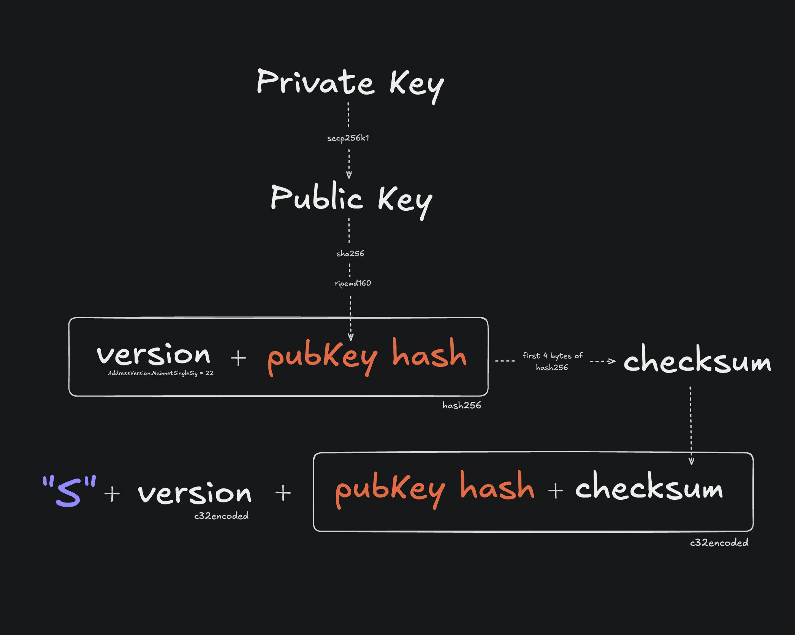
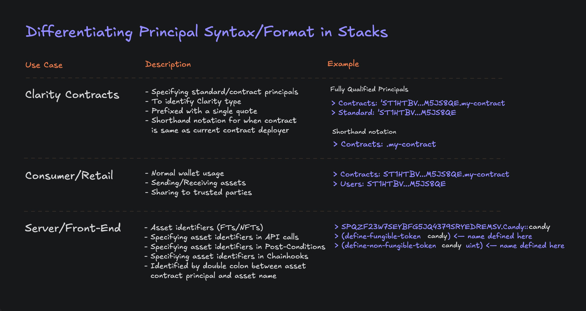
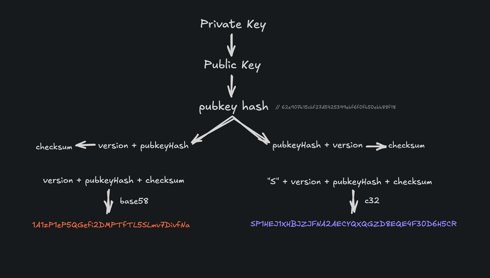

# Wallets & Accounts

<div data-with-frame="true"><figure><figcaption></figcaption></figure></div>


In Stacks, the terms 'address' and 'principal' are used interchangeably.


## Introduction

Stacks wallets are software or hardware tools for storing cryptocurrencies, NFTs, and other digital assets. They are also used for establishing on-chain identity in decentralized applications (dApps). These wallets cryptographically store and manage each user’s identity and funds through a single blockchain address, which leverage public-key cryptography.&#x20;

### Purpose of a Stacks wallet

* Establish User Identity
* Store Assets
* Display Balances
* Sign Transactions
* Sign Messages
* Participate in the Bitcoin Economy

Wallets in Stacks consists of accounts, which uses an accounts-based model, rather than a UTXO model like Bitcoin. This model is simpler than the UTXO model and has a more traditional concept of “balance”, similar to what you would encounter at a bank. In this model, each address has a single “balance” figure for a given token that increases/decreases as transactions are sent to/from that account. This is what most Web3 ecosystems use. In a UTXO model, the network operates as a ledger, with each UTXO being analogous to a cash bill.

### Components of a Stacks account

<div data-with-frame="true"><figure><figcaption></figcaption></figure></div>

* **Private Key** - The private key is an alphanumeric code that is paired to a single public key on a 1:1 basis. Never share your private key with anyone. A private key is how you prove ownership of a public key and how you can spend assets held by that particular key-pair.\
  \
  Example private key in Stacks (32 bytes appended with a 0x01 byte):\
  `5a4133fec2cf923d37238d3ba2fcd2ee9c8dce882c22218fd210d8a02ceb2c7401`
* **Public Key** - The public key is derived mathematically from the private key. It can be shared safely and is used by the network to verify signatures created by the private key, without revealing the private key itself.\
  \
  Example public key in Stacks (compressed format):\
  `02e8eb87862945d369511fdcce326ffef9a01b68c7d070e3ce685a5cbb9b1ecfc5`
* **Address (Principal)** - The address is a shorter, user-friendly representation derived from the public key. It’s what you share to receive sBTC, STX, tokens, or NFTs on Stacks, and it acts as the on-chain identifier for the user.\
  \
  Example public address in Stacks (c32check encoding):\
  `SPM9G3CNGSCTB4956290NESM0MR9W9CCEPVEPSQC`


The private/public key generation uses the cryptographic **secp256k1** curve.

The cryptographic signature algorithm used in Stacks is **ECDSA** over **secp256k1**.

Addresses are created by generating the **RIPEMD-160** hash of the **SHA256** of the public key. BTC addresses are encoded with **Base58Check**. For Stacks addresses, [**c32check**](https://github.com/stacks-network/c32check) is used.


Stacks accounts are entities that own assets, like Stacks (STX) tokens. An account has an address, private key, nonce, and one or more asset balances. Assets cannot leave an account without an action from the account owner. All changes to assets (and the balances of the account) require a corresponding transaction.

All Stacks wallets also support Bitcoin addresses, enabling seamless participation across both the Stacks and Bitcoin ecosystems.

#### Address formats <a href="#address-formats" id="address-formats"></a>

Stacks addresses use different prefixes to indicate the network they belong to, making it easy to distinguish between mainnet and testnet addresses.

```typescript
// Mainnet address starts with 'SP'
const mainnetAddress = 'SP3FGQ8Z7JY9BWYZ5WM53E0M9NK7WHJF0691NZ159';

// Mainnet multisig address starts with 'SM'
const multisigMainnetAddress = 'SM3VDXK3WZZSA84XXFKAFAF15NNZX32CTSG82JFQ4'

// Testnet multisig address starts with 'SN'
const multisigTestnetAddress = 'SNJSPGVBFZHPXGESC9ZQWVFSNF4RHNNRTW2HYYJ7'

// Testnet address starts with 'ST'
const testnetAddress = 'ST2F4BK4GZH6YFBNHYDDGN4T1RKBA7DA1BJZPJEJJ';
```

***

## How to create a Stacks account?

A wallet's account are generated from a 24-word mnemonic phrase conforming to the BIP39 standard. This is often referred to as the **seed phrase**. The seed phrase provides access to Stacks accounts.


If the seed phrase is lost, access to the associated accounts cannot be restored. No person or organization can recover a lost seed phrase.


There are a few different ways to create a Stacks account as both a developer and non-developer.



### Using Stacks.js

For programmatic wallet generation or when restoring accounts from backup, you can derive addresses from a mnemonic seed phrase. Each wallet can contain multiple accounts, all derived from the same seed phrase using different derivation paths.


```typescript
import { generateWallet, generateSecretKey, type Wallet, Account } from '@stacks/wallet-sdk';
import { privateKeyToAddress, privateKeyToPublic } from '@stacks/transactions'

// Generate a new 24-word seed phrase
const secretKey: string = generateSecretKey();

// Or use an existing seed phrase
// const secretKey = 'already owned seed phrase ...';

const wallet: Wallet = await generateWallet({
  secretKey,
  password: 'optional-encryption-password',
});

// Get the first account's public key and address
const account: Account = wallet.accounts[0];
const publicKey = privateKeyToPublic(account.stxPrivateKey);
const mainnetAddress = privateKeyToAddress(account.stxPrivateKey, 'mainnet');

console.log('Private key:', account.stxPrivateKey);
console.log('Address:', mainnetAddress);
// Private key: 97ff523937735dc6c9e3180f98a6aa94f526fbe072230b99e07482260f59988c01
// Address: SP1WNA65XE3M665RJ9AC81J18XPMJ5QC5XJDHWXE
```


For more ways on programmaticly generating keys and accounts, check out the guide [here](https://app.gitbook.com/s/Zz9BLmTU9oydDpL3qiUh/stacks.js/accounts-and-addresses).



### Using the Stacks CLI tool

Using the Stacks CLI tool allows you to manage wallets on the command line.

#### `make_keychain`

```bash
# Install CLI globally
npm install --global @stacks/cli

# Generate a new account and store details in a new file.
# '-t' option makes this a testnet account
stx make_keychain -t > cli_keychain.json

# make_keychain outputs the following:
{
  "mnemonic": "aaa bbb ccc ddd ...",
  "keyInfo": {
    "privateKey": "5a3f1f15245bb3fb...",
    "address": "STJRM2AMVF90ER6G3RW1QTF85E3HZH37006D5ER1",
    "btcAddress": "biwSd6KTEvJcyX2R8oyfgj5REuLzczMYC1",
    "wif": "L4HXn7PLmzoNW...",
    "index": 0
  }
}
```

#### `get_address`

```bash
# Get the address of a private key or multisig private key bundle.
# Gives the BTC and STACKS addresses

stx get_address f5185b9ca93bdcb5753fded3b097dab8547a8b47d2be578412d0687a9a0184cb01
{
  "BTC": "1JFhWyVPpZQjbPcXFtpGtTmU22u4fhBVmq",
  "STACKS": "SP2YM3J4KQK09V670TD6ZZ1XYNYCNGCWCVVKSDFWQ"
}

stx get_address 1,f5185b9ca93bdcb5753fded3b097dab8547a8b47d2be578412d0687a9a0184cb01,ff2ff4f4e7f8a1979ffad4fc869def1657fd5d48fc9cf40c1924725ead60942c01
{
  "BTC": "363pKBhc5ipDws1k5181KFf6RSxhBZ7e3p",
  "STACKS": "SMQWZ30EXVG6XEC1K4QTDP16C1CAWSK1JSWMS0QN"
}
```

For more usage examples, check out the Stacks CLI repo [here](https://github.com/stx-labs/stacks.js/tree/main/packages/cli).



### Using Bitcoin L2 wallet extensions/apps

There are many popular Bitcoin wallets that support Bitcoin layers and metaprotocols. Leather and Xverse are popular options for getting started with Stacks.





### Using other community built tools

Check out the [Stacks Devtools Catalog](https://app.gitbook.com/s/Zz9BLmTU9oydDpL3qiUh/stacks-devtools-catalog) for other creative devtools for creating and managing Stacks wallets.



***

## How are Clarity contract addresses formatted?

On Stacks, a **contract address/principal** uniquely identifies a deployed smart contract and is structured as an account principal plus a contract namespace, forming a unique on-chain identity:

```
<deployer-address>.<contract-name>
```

#### Structure Breakdown

1. **Deployer Address**\
   A standard Stacks principal (derived from a hash160 of a public key), such as:
   * `SP...` → mainnet
   * `ST...` → testnet
2. **Contract Name**\
   An ASCII identifier chosen at deployment time (e.g., `my-token`, `amm-v1`, `nft-market`).

#### Why It’s Structured This Way

Because contract identifiers are namespaced by the deployer’s address:

* Two different accounts can deploy contracts with the same name.
* A single account cannot deploy two contracts with the same name.
* The identifier is deterministic and globally unique.

***

## Handling different formats

It's common for new Stacks developers to get tripped up on the different ways when specifying Stacks' principals (aka addresses) in their development.

Here's a breakdown of dealing with principals in 3 different use cases.

<div data-with-frame="true"><figure><figcaption></figcaption></figure></div>

***

### The Stacks and Bitcoin address connection

What makes Stacks beautifully connected to its L1 settlement layer, Bitcoin, is their many shared aspects. One being how both utilize a similar address generation scheme based on the P2PKH format, which allows for both a Bitcoin & Stacks address to share the same public key hash. If you base58check decode a legacy bitcoin address, you can reveal the public key hash, which can then be used to generate its respective c32check encoded Stacks address.

Programmatically, you could also use a method called `b58ToC32`, from the `c32check` javascript library, which can abstract the conversion for you.

<div data-with-frame="true"><figure><figcaption></figcaption></figure></div>

***

### Additional Resources

* \[[Hiro Blog](https://www.hiro.so/blog/understanding-the-differences-between-bitcoin-address-formats-when-developing-your-app)] Understanding the Differences Between Bitcoin Address Formats
* \[[Hiro Blog](https://www.hiro.so/blog/how-every-stacks-address-has-a-corresponding-bitcoin-address)] How Every Stacks Address Has a Corresponding Bitcoin Address&#x20;
* \[[Hiro Blog](https://www.hiro.so/blog/an-intro-to-web3-wallets-for-web3-founders)] An Intro to Web3 Wallets for Web3 Founders
* \[[Hiro Blog](https://www.hiro.so/blog/why-web3-needs-bitcoin-centric-wallet-standards)] Why Web3 Needs Bitcoin-Centric Wallet Standards
* \[[Stacks YT](https://youtu.be/RvTuex1jbGY?si=KGEGESS3sr38G_Tj)] How to Set Up Your First Bitcoin L2 Wallet
* \[[SIP-005](https://github.com/stacksgov/sips/blob/main/sips/sip-005/sip-005-blocks-and-transactions.md)] For the technical breakdown and standard on how wallets/accounts are generated.
