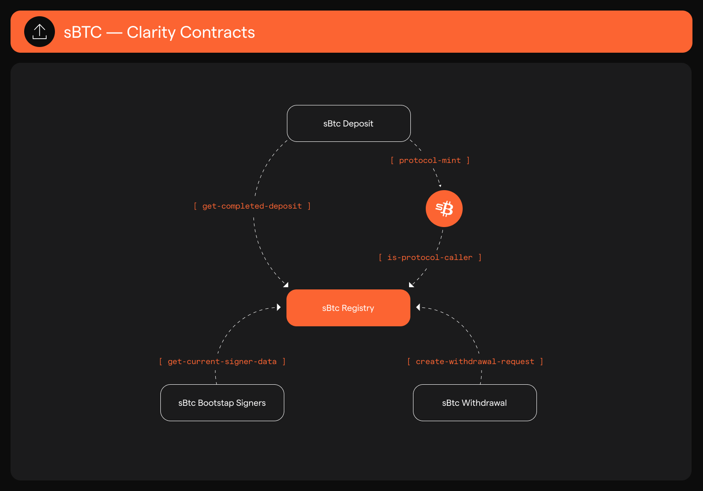

# Clarity Contracts

<figure><figcaption></figcaption></figure>

### Deployed Mainnet Contracts

* [sbtc-token](https://explorer.hiro.so/txid/SM3VDXK3WZZSA84XXFKAFAF15NNZX32CTSG82JFQ4.sbtc-token?chain=mainnet)
* [sbtc-registry](https://explorer.hiro.so/txid/SM3VDXK3WZZSA84XXFKAFAF15NNZX32CTSG82JFQ4.sbtc-registry?chain=mainnet)
* [sbtc-deposit](https://explorer.hiro.so/txid/SM3VDXK3WZZSA84XXFKAFAF15NNZX32CTSG82JFQ4.sbtc-deposit?chain=mainnet)
* [sbtc-withdrawal](https://explorer.hiro.so/txid/SM3VDXK3WZZSA84XXFKAFAF15NNZX32CTSG82JFQ4.sbtc-withdrawal?chain=mainnet)
* [sbtc-bootstrap-signers](https://explorer.hiro.so/txid/SM3VDXK3WZZSA84XXFKAFAF15NNZX32CTSG82JFQ4.sbtc-bootstrap-signers?chain=mainnet)

### sBTC Clarity Contracts

At a high level, the sBTC Clarity contracts are responsible for the following:

#### sbtc-bootstrap signers

Core contract for meta signer functionality such as registration & the rotation process.

#### sbtc-deposit

Processing contract called by the signers to record a consumed Bitcoin transaction & mint some amount of sBTC to a principal contained in the payload.

#### sbtc-registry

State storage for maintaining upgradability across protocol.

#### sbtc-withdrawal

Interaction points for users and signers to update withdrawal request state.

<figure><figcaption></figcaption></figure>

### User Types

In addition to the contracts themselves, there are two main user types that will interact with these contracts.

#### Signer

A signer that is part of the current sBTC signer set. More information on signers and their role in sBTC can be found in the [Signer Process Walkthrough](../walkthroughs/signer-process-walkthrough.md).

#### Wallet

A participant in the Stacks/Bitcoin ecosystem that wants to deposit/withdraw/use sbtc.
