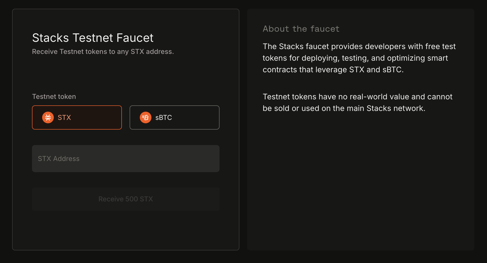

# The Bitcoin Connection

<figure><figcaption></figcaption></figure>

In the previous section, we described Stacks as bringing smart contract functionality to Bitcoin, without modifying Bitcoin itself, and explained a bit about how the chain works. That's a big promise, but how does Stacks actually deliver on it? And what makes Stacks unique among other Bitcoin layers and other blockchains like Ethereum?

Before we get into the technical details of how Stacks works, it's important to get a high-level overview of the problem it's solving and how it actually does that. We'll dive deeper into some of these topics as we go through the docs, but it's good to get a high-level picture to bring everything together. This topic is a bit of a rabbit hole, but it will give you an in-depth understanding of exactly the problem Stacks is looking to solve, and how it solves it.

Let's get into it.

### What's the purpose of a Bitcoin layer?

The decentralization of trust is the primary innovation and promise of blockchains. Even in the\
world of cryptocurrencies, recent failures in 2022 have been of centralized entities, further\
highlighting the importance of systems that don’t rely on “trusted” centralized intermediaries.\
Bitcoin is the most secure, durable, and valuable blockchain; it is already used as a store of\
value by millions of people. It is robust, "hard" money, with unprecedented non-custodial\
ownership and lack of inflation. The Bitcoin blockchain is also the best settlement layer for\
transactions, as it is the most decentralized, censorship-resistant, and durable blockchain.

However, Bitcoin is relatively slow and minimal by design and conservative in its evolution to\
preserve these powerful properties. It produces blocks on average every 10 minutes, with only\
5-7 transactions per second. It does not provide native support for fully-expressive smart\
contracts and hence for sophisticated applications that can utilize its properties. The result is\
that Bitcoin has remained a passive rather than a productive asset. Despite its attractive and\
unique properties, it has not been a platform for applications besides a store of value and\
infrequent money movement.

Bitcoin layers change this. Bitcoin layers extend the functionality and performance of the\
Bitcoin blockchain without requiring any changes to it.

### How would we define what a Bitcoin layer is?

It is important to define what is meant by a Bitcoin layer. While there are several nuanced opinions on what makes a system a Layer 2 on top of a Layer 1, these are the properties we believe comprise an ideal Bitcoin L2 and the assumptions we make:

1. Open-source and decentralized development process
2. Full VM support and ability to program with expressive, high-level languages
3. Fast transaction and block times (don’t need to wait 10-30 minutes for Bitcoin blocks)
4. A trust-minimized way to move BTC between L1 and L2
5. BTC as the primary asset deployed in L2 apps
6. The ability to pay for L2 transactions in BTC
7. The ability to unilaterally withdraw your BTC back from the L2 with no counterparty risk

Stacks V1 had properties 1 and 2, but was missing the rest. The Nakamoto upgrade brings properties 3, 4, and 5, with discussions and work currently underway to accomplish 6. Currently, Lightning is the only L2 that has property 7, and the only way to truly take advantage of this is to run your own Lightning node, a complex undertaking few users engage in. Furthermore, Lightning is missing property 2, which means we cannot unlock any additional functionality beyond what that Bitcoin L1 is already capable of.&#x20;

It’s important to acknowledge that Bitcoin L2s have fundamentally different goals than L2s on other L1s like Ethereum. While the primary motivation for L2s on Ethereum is to enhance\
scalability, Bitcoin L2s serve the purpose of enhancing both scalability and functionality.\
This means that the Bitcoin layer cannot verify the validity of transactions that occur on L2s\
like Stacks. Instead the VM for that layer is responsible for transaction processing and\
verification, and settling those transactions down to Bitcoin so that they share the same history\
and finality.



### Is Stacks a Bitcoin L2?

Stacks is a Bitcoin layer for smart contracts. The classification as a layer-1 (L1) or layer-2 (L2) or sidechain really depends on the definition used. With that said, generally speaking L1 chains are sovereign meaning that (a) they have their own security budget, and (b) they can survive without the need for any other L1 chain. L2 chains typically do not have their own security budget and share the security of the underlying L1 chain, and they cannot live without the underlying L1 chain. There are many different design mechanisms that L2s can use.

The initial release of Stacks in early 2021 had a separate security budget from Bitcoin L1. Even though the Stacks layer could not function without Bitcoin L1, the developers working on the project described it as a different system that does not fit neatly into existing classifications, sometimes using the term layer 1.5 (see [this Decrypt article](https://decrypt.co/82019/bitcoin-defi-thing-says-stacks-founder-muneeb-ali) for example).

The Nakamoto release in 2024 enabled Stacks to share the same security budget from Bitcoin. Instead, 100% of Bitcoin hashpower will determine finality on the Stacks layer. To reorg Stacks blocks/transactions the attacker will need to reorg Bitcoin L1 itself (which is very hard to do and therefore a great security property for a Bitcoin layer to have).

The definition of L2 used in Ethereum and other newer ecosystems is different and focuses on the ability to withdraw assets using only L1 security and L1 miners. According to that definition Stacks layer is not a clear L2, given the set of peg-out signers determine if users can withdraw sBTC. Bitcoin cannot support such verification without changes to Bitcoin L1 (which may happen in the future). The Ethereum L2 definition also does not apply that cleanly to Bitcoin L2s, given new assets are issued on L2s when it comes to Bitcoin and not issued on L1 (only BTC is the L1 asset). Therefore, using the definition of security of withdrawing assets is not directly applicable given assets are defined and used on L2s and not withdrawn out to Bitcoin L1 anyway (with the exception of BTC itself). Rather, what becomes more important is "settlement on Bitcoin" i.e., is contract data and state secured by 100% of Bitcoin's hashpower or not.

Remember that L2s on Bitcoin also have to serve the additional purpose of expanding both functionality and scalability, which means L2s accomplish fundamentally different goals depending on the functionality of the L1.

Users and developers organically call Stacks a Bitcoin L2, since it is a simpler concept to understand. There are certain properties of Stacks layer that also help the concept of Stacks as a Bitcoin L2:



**Bitcoin finality**

100% of the Bitcoin hashpower decides block ordering and transaction finality.



**Consensus runs on Bitcoin**

Stacks consensus runs on Bitcoin L1, and Stacks L2 cannot operate or survive without Bitcoin L1.



**sBTC and economic unit**

With the decentralized Bitcoin peg, sBTC, most of the economy on Stacks layer will use BTC as the unit of economy. It is expected that most users will simply use Bitcoin in wallets and apps and then peg out their BTC to Bitcoin L1.



**Data hashed and stored on Bitcoin**

All data and transactions on Stacks are automatically hashed and permanently stored on Bitcoin L1 on every Bitcoin block. Anyone can verify that some data on Stacks is valid by checking the corresponding hash on Bitcoin. This compact storage of hashes on the L1 is somewhat similar to rollups (although there are other differences). You can read more about this process in the [Block Production](../block-production/) section.



**Contracts can read Bitcoin state**

Contracts on Stacks layer can read Bitcoin L1 transactions and respond to them. Assets on Stacks layer can be moved simply through Bitcoin L1 transactions.



<strong>Addressing the skeptics and critics</strong>

Given all the details above, why would some people think that Stacks is not a Bitcoin L2? There are a couple of reasons this question comes up often:

* **Old security-budget material**: The initial version of Stacks (released early 2021) had a separate security budget which changed to inherit 100% Bitcoin hashpower with the Nakamoto release.
* **Ethereum L2 withdrawal definition doesn't map cleanly**: According to the Ethereum definition of L2s a user should be able to withdraw their base-layer assets purely by doing an L1 transaction and relying only on L1 security (this is true for Lightning for example). This definition does not apply cleanly to Bitcoin L2s because assets are not defined at Bitcoin L1 but are defined in L2s instead. The only asset where this matters is the pegged BTC asset from Bitcoin L1, given all other assets are native to L2s anyway. In the upcoming Stacks release, users can withdraw their BTC by sending just a Bitcoin L1 transaction but Bitcoin L1 cannot validate that complex transaction and a majority of peg-out signers will need to sign on the peg-out request. In an ideal world Bitcoin miners can validate such transactions but that would require a change to Bitcoin L1. Therefore, Stacks design optimizes for a method that is decentralized and can be deployed without any changes to Bitcoin L1. If in the future it is possible to make changes to Bitcoin L1 then Stacks layer security can benefit from that as well.
* **Healthy Bitcoin skepticism**: Bitcoin community members are generally skeptical of claims and on the lookout for people making any false marketing claims. This is generally a healthy thing for the Bitcoin ecosystem and builds up the immune system. Some such community members might be skeptical about Stacks as a Bitcoin layer or L2 until they fully read the technical details and reasoning. There is a good Twitter thread about this topic as well.

Why don't we use the term 'sidechain' for Stacks then? Sidechains in Bitcoin typically have a different security budget from the Bitcoin L1, typically as a subset of Bitcoin miners who participate in the sidechain (they don't follow 100% Bitcoin finality), their consensus runs on the sidechain (vs running on Bitcoin L1), and they don't publish their data/hashes on Bitcoin L1. The Stacks layer does not fit that definition cleanly given the consensus runs on Bitcoin L1, it follows Bitcoin finality, and publishes data/hashes on L1.

### The Symbiotic Relationship Between Stacks and Bitcoin

Stacks and Bitcoin complement each other. Stacks leverages the extreme decentralization of Bitcoin, its PoW consensus mechanism, and its value as a cryptocurrency.

But Stacks also complements Bitcoin by unlocking additional use cases, thereby increasing its value over time. This also helps to solve the additional problem of the future maintainability of Bitcoin after the coinbase rewards are gone and Bitcoin has to function on transaction fees alone.



If Bitcoin is seen as only a store of value, the economic density, meaning how much value is being exchanged, of each transaction will be minimal. But if Bitcoin is the underlying foundation for an entire decentralized economy, those transactions become much more valuable, increasing transaction fees. This is a crucial incentive for miners to continue securing the network as coinbase rewards drop.

### On Crafting a Bitcoin-First Developer Experience

One of the things that gives the Stacks network its superpowers in connecting with Bitcoin is not only how it connects to Bitcoin at a protocol level, discussed above, but also how we can utilize that Bitcoin at a programmatic level.

The DevEx for a Bitcoin L2 should abstract away Bitcoin’s complexity but also maintain the _feeling_ of building on Bitcoin. Sounds like a contradiction but here's how Stacks pulls it off:



#### Sustain bitcoin movements with sBTC

<figure><figcaption></figcaption></figure>

sBTC unlocks Bitcoin’s programmability. You get L2 expressivity without losing Bitcoin’s familiar properties: denomination, representation, and trust model.



#### Plug directly into BTCFi

<figure><figcaption></figcaption></figure>

Zest, Bitflow, StackingDAO, Dual Stacking, and other major DeFi protocols on Stacks offer developer tooling for smart, composable, and Bitcoin-first applications.



#### One cryptographic identity

<figure><figcaption></figcaption></figure>

Stacks uses the _same_ cryptographic primitive — same curve (secp256k1), same `hash160` construction — to derive Stacks addresses. They’re formatted differently (different version bytes / encoding), but underneath: the identity anchor is the same 20-byte public key hash.

Different layers. Same cryptographic private key.



#### React to Bitcoin state

<figure><figcaption></figcaption></figure>

One of the often-touted features of Clarity is that it has access to the state of the Bitcoin chain built in, but how does it actually do that? Because of Stacks' PoX mechanism, every Stacks block is connected to a Bitcoin block, and can query Bitcoin block header hashes with the `get-burn-block-info?` function.&#x20;

Clarity can read Bitcoin state directly. Parse BTC transactions. Trigger logic based on Bitcoin activity.



#### Capture time on the L2 at Bitcoin speed

<figure><figcaption></figcaption></figure>

Clarity contracts can measure time by Bitcoin blocks. This is not just technical — it's symbolic: Like tracking time by the sun, we trust Bitcoin’s cadence.



***

### Additional Resources

* \[[Hiro Blog](https://www.hiro.so/blog/building-on-bitcoin-project-comparison)] Building on Bitcoin: a Comparison of Bitcoin Projects
* \[[Hiro Books](https://www.hiro.so/books/a-beginners-guide-to-bitcoin-layers)] A Beginner's Guide to Bitcoin Layers
* \[[Stacks YT](https://www.youtube.com/watch?v=F31B-my510A)] The Stacks & Bitcoin Miners Relationship
