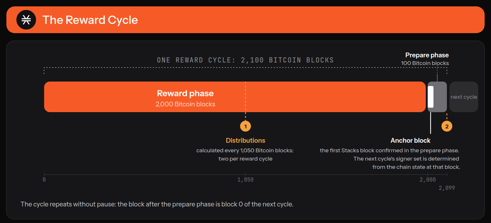

# Proof of Transfer (PoX)

<figure><picture><source srcset="../.gitbook/assets/pox-light.png" media="(prefers-color-scheme: dark)"></picture><figcaption></figcaption></figure>

In the previous sections we looked at the vision and ethos of Stacks, and at how it connects to Bitcoin without modifying Bitcoin itself. This section covers the mechanism that makes that work, Proof of Transfer, and the five versions it has been through.


This is a conceptual overview. For how block production works step by step, see [Block Production](../block-production/). For how to take part and what you earn, see [Bitcoin Staking](../bitcoin-staking/).


### What is Proof of Transfer?

The Stacks layer relies on both STX and BTC for its consensus mechanism, Proof of Transfer. PoX is similar in spirit to Bitcoin's Proof of Work: where Bitcoin miners spend electricity and are rewarded in BTC, Stacks miners spend already-mined BTC and are rewarded in STX.

Like Proof of Work, PoX uses a single-leader election. Miners bid by spending BTC and have a bid-weighted random probability of becoming the leader. Leader election happens on the Bitcoin chain; new blocks are written on the Stacks layer. PoX reuses work Bitcoin miners have already done and consumes no significant additional electricity.

Like Proof of Work, PoX is permissionless. Anyone can mine, as long as they are willing to spend BTC. Anyone holding STX can lock it to help secure the chain and earn Bitcoin-denominated rewards, and holders of BTC can do the same by bonding it.

PoX gives the network two properties that work together.

**Economic.** Miner BTC funds the rewards paid to participants, so the Stacks economy is anchored to Bitcoin rather than to inflation alone. Miners commit BTC to compete for the right to produce blocks and earn newly minted STX plus transaction fees in return. The BTC they commit is what participants are paid from.

**Programmatic.** Miner BTC commitments on Bitcoin are the input to leader selection, which determines who builds the next Stacks block. Blocks are then cryptographically linked and anchored to Bitcoin, inheriting its settlement assurances. PoX is not only an exchange of value: it is the consensus engine that orders and finalises blocks while keeping a verifiable link to Bitcoin L1.

<figure><figcaption>
Two currencies moving in opposite directions. BTC flows from miners to participants; STX flows from the protocol to miners.
</figcaption></figure>

### Who takes part

Four roles, each documented in full elsewhere.

| Role             | What they do                                                                                                             | Where to read more                        |
| ---------------- | ------------------------------------------------------------------------------------------------------------------------ | ----------------------------------------- |
| Miners           | Spend BTC to compete for the right to produce a tenure of Stacks blocks, and earn the STX coinbase plus transaction fees | [Mining](../block-production/mining.md)   |
| Stacks signers   | Validate and append blocks. A block is accepted once signers holding at least 70% of the weight approve it               | [Signing](../block-production/signing.md) |
| Bitcoin stakers  | Lock BTC on Bitcoin L1 under their own keys, paired with STX, and earn BTC-denominated yield                             | [Bitcoin Staking](../bitcoin-staking/)    |
| STX-only stakers | Stake STX to a signer and earn a share of what is left after bond obligations are met                                    | [Staking](../block-production/staking.md) |

<figure><figcaption>
Staked STX is what gives signers their weight. Miner BTC is what pays the yield.
</figcaption></figure>

### How the mechanism works



**Leader election**

Miners commit BTC in a Bitcoin transaction carrying a block hash and a VRF seed. A cryptographic sortition picks one winner per Bitcoin block, deterministically but unpredictably, weighted by the BTC each miner committed. The winner produces that tenure's Stacks blocks.



**Reward distribution**

The BTC miners commit funds the reward pool. Under PoX-5 each block-commit pays a single output, the pool auto-bridges to sBTC, and payouts are made through a three-tranche waterfall: active protocol bonds first, then STX-only stakers, then the reserve. A distribution is calculated every 1,050 Bitcoin blocks, twice per reward cycle.



**Block signing**

Signers replicate and sequence blocks proposed by the miner. Each signer's vote is weighted, and a block is appended once signers holding at least 70% of the weight have approved it. The signer set is fixed for a reward cycle and is determined during the prepare phase.



Cycle structure is the same in every version of PoX: a reward cycle is 2,100 Bitcoin blocks, made up of a reward phase of 2,000 blocks followed by a prepare phase of 100. The anchor block is the first Stacks block confirmed in the prepare phase, and the next cycle's signer set is determined from the chain state at that block.

<figure><figcaption>
The cycle repeats without pause: the block after the prepare phase is block 0 of the next cycle.
</figcaption></figure>

### Versions of Proof of Transfer

Proof of Transfer is implemented on the Stacks network as a Clarity smart contract, and has been through five versions.

| Version | Date       | Mainnet contract                                                                                         | SIP                                                                                                  |
| ------- | ---------- | -------------------------------------------------------------------------------------------------------- | ---------------------------------------------------------------------------------------------------- |
| PoX 5   | 2026-07-30 | [SP000000000000000000002Q6VF78.pox-5](https://explorer.hiro.so/txid/SP000000000000000000002Q6VF78.pox-5) | [SIP-045](https://github.com/stacksgov/sips/blob/main/sips/sip-045/sip-045-pox-5-bitcoin-staking.md) |
| PoX 4   | 2024-04-22 | [SP000000000000000000002Q6VF78.pox-4](https://explorer.hiro.so/txid/SP000000000000000000002Q6VF78.pox-4) | [SIP-021](https://github.com/stacksgov/sips/blob/main/sips/sip-021/sip-021-nakamoto.md)              |
| PoX 3   | 2023-05-27 | [SP000000000000000000002Q6VF78.pox-3](https://explorer.hiro.so/txid/SP000000000000000000002Q6VF78.pox-3) | [SIP-022](https://github.com/stacksgov/sips/blob/main/sips/sip-022/sip-022-emergency-pox-fix.md)     |
| PoX 2   | 2023-03-20 | [SP000000000000000000002Q6VF78.pox-2](https://explorer.hiro.so/txid/SP000000000000000000002Q6VF78.pox-2) | [SIP-015](https://github.com/stacksgov/sips/blob/main/sips/sip-015/sip-015-network-upgrade.md)       |
| PoX 1   | 2021-01-15 | [SP000000000000000000002Q6VF78.pox](https://explorer.hiro.so/txid/SP000000000000000000002Q6VF78.pox)     | [SIP-007](https://github.com/stacksgov/sips/blob/main/sips/sip-007/sip-007-stacking-consensus.md)    |

PoX-5 is the largest change since the original design. Miner BTC no longer pays stacker reward addresses directly and nothing is burned, and BTC holders can now take part by bonding BTC rather than only by holding STX. For what changed and what former stackers needed to do, see [What's Changed in PoX-5](https://docs.stacks.co/operate/staking-stx/whats-changed-in-pox-5).

The [Example Contracts](https://app.gitbook.com/s/uholC0CdufHxYs050O3V/clarity/example-contracts) section includes a walkthrough of the PoX-4 contract.

***

### Additional Resources

* \[[SIP-001](https://github.com/stacksgov/sips/blob/main/sips/sip-001/sip-001-burn-election.md)] SIP-001 provides a full list of reasons why Bitcoin was chosen to secure Stacks.
* \[[SIP-007](https://github.com/stacksgov/sips/blob/main/sips/sip-007/sip-007-stacking-consensus.md)] Details of the original design for stacking and Proof of Transfer.
* \[[SIP-021](https://github.com/stacksgov/sips/blob/main/sips/sip-021/sip-021-nakamoto.md)] Nakamoto Upgrade: Fast and reliable blocks
* \[[SIP-045](https://github.com/stacksgov/sips/blob/main/sips/sip-045/sip-045-pox-5-bitcoin-staking.md)] PoX-5: Bitcoin Staking and the emission schedule
* \[[Stacks Developers YT](https://youtu.be/YynwIJIXJWw?si=9DXsd9PzMN14xt-L)] PoX: Under the Hood
* \[[Stacks Developers YT](https://youtu.be/4UJ3ZK8JsrI?si=m8VSVIuCwIyOe3pe)] How Do Developers Test the Stacks Network?
* \[[Hiro YT](https://youtu.be/2Bmo1cK0C8k?si=uiYaXudIhjxkNaS6)] A Breakdown of Stacks' Proof of Transfer Smart Contract
