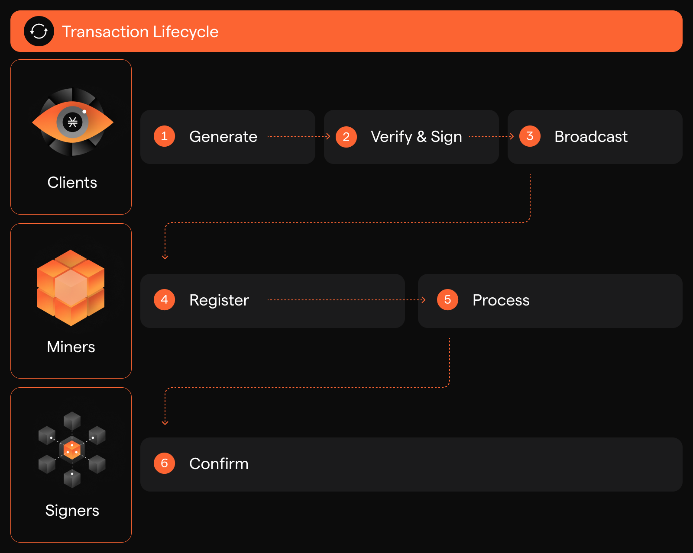

# How Transactions Work

<div data-with-frame="true"><figure><figcaption></figcaption></figure></div>

### Introduction

Transactions are the fundamental unit of execution in Stacks. Each transaction is originated from a Stacks account, and is retained in the Stacks network history for eternity. This guide helps you understand Stacks transactions.

### Lifecycle

Transactions go through phases before being finally confirmed.

<div data-with-frame="true"><figure><figcaption></figcaption></figure></div>



**Generate**

Transactions are assembled according to the encoding specification.



**Validate and sign**

Transactions are validated to confirm they are well-formed. Required signatures are filled in.



**Broadcast**

Transactions are sent to a node.



**Register**

A miner receives transactions, verifies, and adds them to the mempool, a holding area for all the pending transactions.



**Process**

Miners review the mempool and select transactions for the next block to be mined. Depending on the transaction type, different actions can happen during this step. For example, post-conditions could be verified for a token transfer, smart-contract defined tokens could be minted, or an attempt to call an existing smart contract method could be made.



**Confirm**

Miners successfully propose blocks with a set of transactions. The transactions inside are successfully propagated to the network when the stackers approve them.




A transaction can have one of three states once it is registered: `pending`, `success`, or `failed`.


### Types

Stacks supports a set of different transaction types:

| **Type**                  | **Value**                 | **Description**                                                                                                                                                                                                                                                             |
| ------------------------- | ------------------------- | --------------------------------------------------------------------------------------------------------------------------------------------------------------------------------------------------------------------------------------------------------------------------- |
| Tenure change             | `TenureChange`            | A tenure change is an event in the existing Stacks blockchain when one miner assumes responsibility for creating new stacks blocks from another miner. A change in tenure occurs when a Stacks block is discovered from a cryptographic sortition. Carried out by stackers. |
| Tenure change block found | `TenureChange-BlockFound` | A `TenureChange-BlockFound` transaction is induced by a winning sortition. This causes the new miner to start producing blocks, and stops the current miner from producing more blocks.                                                                                     |
| Tenure change extend      | `TenureChange-Extend`     | A `TenureChange-Extend`, which is induced by Stackers, resets the current tenure's ongoing execution budget, thereby allowing the miner to continue producing blocks.                                                                                                       |
| Token transfer            | `token_transfer`          | Asset transfer from a sender to a recipient                                                                                                                                                                                                                                 |
| Contract deploy           | `smart_contract`          | Contract instantiation                                                                                                                                                                                                                                                      |
| Contract call             | `contract_call`           | Contract call for a public, non read-only function                                                                                                                                                                                                                          |

## Fees

Fees are used to incentivize miners to confirm transactions on the Stacks blockchain. The fee is calculated based on the estimate fee rate and the size of the raw transaction in bytes. The fee rate is a market determined variable. For the testnet, it is set to 1 micro-STX.

## Nonces

Every account carries a [nonce property](https://en.wikipedia.org/wiki/Cryptographic_nonce) that indicates the number of transactions processed for the given account. Nonces are one-time codes, starting at `0` for new accounts, and incremented by 1 on every transaction.

Nonces are added to all transactions and help identify them in order to ensure transactions are processed in order and to avoid duplicated processing.


The consensus mechanism also ensures that transactions aren't "replayed" in two ways. First, nodes query its unspent transaction outputs (UTXOs) in order to satisfy their spending conditions in a new transaction. Second, messages sent between nodes review sequence numbers.


When a new token transfer transaction is constructed, the most recent nonce of the account needs to be fetched and set.

### How nonce gaps are detected and resolved

Stacks transactions must be executed **strictly in nonce order**. When a transaction is submitted with a nonce higher than expected, the network does **not** reject it outright—instead, it tracks the gap and waits for the missing nonces to arrive.

Below is a conceptual walkthrough, with visual responses from the API, of how the system behaves when nonces are submitted out of order.



#### Initial state (no pending transactions)

```json
{
  last_mempool_tx_nonce: null,
  last_executed_tx_nonce: 241,
  possible_next_nonce: 242,
  detected_missing_nonces: [],
  detected_mempool_nonces: []
}
```

**Interpretation**

* All transactions up to nonce `241` have executed
* The network expects nonce `242` next
* No transactions are currently waiting in the mempool
* No nonce gaps exist



#### Submitting a future nonce (`245`)

```json
{
  last_mempool_tx_nonce: 245,
  last_executed_tx_nonce: 241,
  possible_next_nonce: 246,
  detected_missing_nonces: [244, 243, 242],
  detected_mempool_nonces: []
}
```

**Interpretation**

* A transaction with nonce `245` is now in the mempool
* Nonces `242`, `243`, and `244` are missing
* Execution cannot proceed until those nonces are submitted
* `possible_next_nonce` reflects the highest observed nonce + 1



#### Submitting a partial gap (`243`)

```json
{
  last_mempool_tx_nonce: 245,
  last_executed_tx_nonce: 241,
  possible_next_nonce: 246,
  detected_missing_nonces: [244, 242],
  detected_mempool_nonces: [243]
}
```

**Interpretation**

* Nonce `243` is now present in the mempool
* Nonces `242` and `244` are still missing
* Execution is still blocked
* The API distinguishes between:
  * `detected_mempool_nonces` → present but unexecuted
  * `detected_missing_nonces` → required but not yet seen



#### Filling more gaps (`244`)

```json
{
  last_mempool_tx_nonce: 245,
  last_executed_tx_nonce: 241,
  possible_next_nonce: 246,
  detected_missing_nonces: [242],
  detected_mempool_nonces: [243, 244]
}
```

**Interpretation**

* Nonces `243` and `244` are both waiting in the mempool
* Nonce `242` is still missing
* Execution remains paused at `241`



#### All required nonces present (`242`)

```json
{
  last_mempool_tx_nonce: 245,
  last_executed_tx_nonce: 241,
  possible_next_nonce: 246,
  detected_missing_nonces: [],
  detected_mempool_nonces: [242, 243, 244]
}
```

**Interpretation**

* All required nonces (`242–245`) are now available
* No gaps remain
* The network can execute transactions sequentially



#### After execution completes

```json
{
  last_mempool_tx_nonce: null,
  last_executed_tx_nonce: 245,
  possible_next_nonce: 246,
  detected_missing_nonces: [],
  detected_mempool_nonces: []
}
```

**Interpretation**

* All pending transactions have executed
* The account nonce has advanced to `245`
* The next valid nonce is now `246`
* The mempool state is clean again


