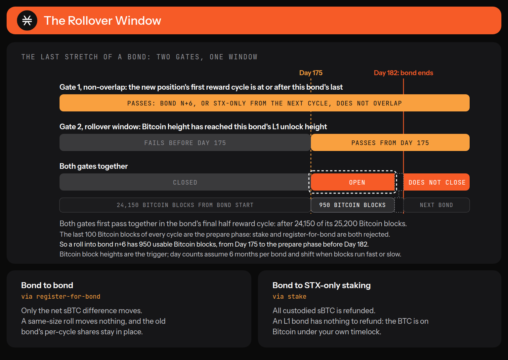

# Ending or Changing a Bond Position

A protocol bond is a 12-cycle commitment. Which routes are open to you depends on one thing: whether the bond's Bitcoin leg is a native L1 timelock or locked sBTC. The contract enforces that split strictly, and calling the wrong function returns an error that does not say "wrong path".

For STX-only staking, see [Stake to an Existing Signer-Manager](../staking-stx/stack-with-a-pool.md).

## Pick your route

| Acting on the Bitcoin leg        | Native BTC (L1 lock)                                     | sBTC lock                          |
| -------------------------------- | -------------------------------------------------------- | ---------------------------------- |
| Withdraw part of it              | Not available. Use early exit                            | `unstake-sbtc`                     |
| Give up the position before term | `announce-l1-early-exit`, then a co-signed Bitcoin spend | `unstake-sbtc` for the full amount |

Whichever leg you hold:

* **Change signer-manager mid-term:** `update-bond-registration`.
* **Get your STX back before the term ends:** not possible by either route.


**Nothing on this page unlocks your STX early.** Both exit routes act on the Bitcoin leg. The STX leg stays locked until the bond term ends, and the contract says so in its comment on the early-exit function: "The staker's locked STX is intentionally untouched."


Rolling into a new bond or into STX-only staking happens at the end of a bond, not mid-term. See [Rolling into a new position](ending-or-changing-a-bond-position.md#rolling-into-a-new-position).

## Early exit on a native BTC bond

An early exit is a Stacks transaction followed by a Bitcoin transaction:

1. `announce-l1-early-exit` on Stacks tells the contract the position is exiting. Only the staker can send it.
2. A Bitcoin transaction spends the lockup UTXO through the lockup script's early-exit branch. It needs your signature and a co-signature from the early-exit signing service.

Announce first. The contract enforces no order between the two, but the co-signer signs only after it finds your announce transaction on Stacks. The position stops earning as soon as the announcement lands, not when the BTC moves.

Co-signing is only needed before the timelock height. After the CLTV height you reclaim alone through the timelock branch, with no co-signer and no service involved.

What it costs: the undistributed yield for the rest of the term is forfeited, and the paired STX stays locked until the bond ends.


**Keep your lock script.** The contract does not store your `staker-unlock-bytes` or the lock script built from them, so save the lock script when you register. If you lose it, rebuild it from your `register-for-bond` transaction, which carries the unlock bytes and the unlock height as arguments. With the default unlock bytes, you can also rebuild them from the public key of the Bitcoin key you registered with. Without the lock script, the locked BTC cannot be spent by either path, timelock or early exit.


### How the lockup script allows it

Your L1 lockup is a P2WSH script with two branches. The timelock branch needs your signature after the CLTV height. The early-exit branch needs the 32-byte preimage committing you to the bond, a signature satisfying that bond's early-unlock subscript, and your own signature, all together. The early-unlock key alone cannot move your coins, and you alone cannot move them before the timelock.

The bond admin sets the early-unlock subscript per bond at `setup-bond`. The contract permits a single-key `OP_CHECKSIG` or an M-of-N `CHECKMULTISIG` template and stores it as an opaque buffer. Every deployed bond uses the single-key form: one cosigner public key with `OP_CHECKSIG`, held by a redundant, KMS-backed signing service. Read the bond's `early-unlock-bytes` rather than assuming either form.

### What the contract checks

`announce-l1-early-exit` checks, in order:

* Not in the prepare phase, or `ERR_STAKE_IN_PREPARE_PHASE (u47)`.
* No re-entrancy through the signer-manager trait call, or `ERR_REENTRANT_CALL (u49)`.
* `contract-caller` equals `tx-sender` and equals the `staker` argument, or `ERR_UNAUTHORIZED (u1)`. You must send it yourself. No contract can announce on your behalf, so a pool or a smart-contract wallet cannot do it for you.
* The membership is an L1 lock, or `ERR_CANNOT_ANNOUNCE_L1_EARLY_UNLOCK (u35)`. An sBTC bond gets this error; use `unstake-sbtc` instead.
* The signer-manager you pass matches your current signer, or `ERR_INVALID_OLD_SIGNER_MANAGER (u36)`.
* You have not already announced for this bond, or `ERR_L1_EARLY_EXIT_ALREADY_ANNOUNCED (u50)`.

### What announcing changes

Your `amount-sats` is set to `u0` and the bond's total staked drops by that amount, after outstanding rewards are settled. The membership row stays: you remain a bond participant with a zero-sats position until the term ends. That is why your STX stays locked and why you cannot start a new bond in the meantime.

Announcing a second time fails with `u50`, so check `fetchHasAnnouncedL1EarlyExit` before offering the action. Announcing without ever spending on L1 only forfeits your yield.

The code for both transactions is under [Building an early exit](ending-or-changing-a-bond-position.md#building-an-early-exit).

## Withdrawing from an sBTC bond

`unstake-sbtc` withdraws part or all of your locked sBTC and transfers it straight back to you. There is no announcement step, no co-signer, and no bond deadline.

It is still gated on:

* Not in the prepare phase, or `ERR_STAKE_IN_PREPARE_PHASE (u47)`. That rules out the last 100 Bitcoin blocks of each cycle.
* The membership is not an L1 lock, or `ERR_CANNOT_UNSTAKE_SBTC (u38)`.
* The signer-manager you pass matches your current signer, or `ERR_INVALID_OLD_SIGNER_MANAGER (u36)`.
* The amount does not exceed your current stake, or `ERR_INVALID_UNSTAKE_SBTC_AMOUNT (u37)`.
* No re-entrancy.

The staker is taken from `tx-sender`, not passed as an argument. A pool contract calling it withdraws the pool's own position, never a member's.

A partial withdrawal leaves the membership in place with a reduced `amount-sats`. Withdrawing everything leaves a zero-sats membership, the same end state as an L1 early exit.

`unstake-sbtc` keeps working after the bond ends. It reads the membership map directly, while `announce-l1-early-exit` and `update-bond-registration` go through `get-bond-membership`, which returns nothing once the term has passed. After your bond ends you can still retrieve sBTC with `unstake-sbtc`, but the other two reject you with `ERR_NOT_BOND_PARTICIPANT (u34)`.

The code is under [Building an sBTC withdrawal](ending-or-changing-a-bond-position.md#building-an-sbtc-withdrawal).

## Re-pointing to a different signer-manager

`update-bond-registration` moves an active bond to a new signer-manager mid-term. It settles rewards with both the old and new signer, moves your shares from the old to the new, and takes effect from the next reward cycle, or from the bond's start cycle if the bond has not begun.

It reverts with `ERR_UPDATE_BOND_SAME_SIGNER (u44)` if the new signer-manager is the one you already have, and is rejected in the prepare phase. The new signer-manager must already be registered with a live signer key grant, or `ERR_SIGNER_KEY_GRANT_NOT_FOUND (u17)`.

Your locked amounts and your term do not change. This changes who manages the position, not what is locked.

## Rolling into a new position

When your bond is ending you can go straight into a new bond, or out of bonding and into STX-only staking, without withdrawing and starting over. The move opens only when these gates pass together:

* **Non-overlap.** The new position's first reward cycle must be at or after the old bond's last. `register-for-bond` rejects an overlap with `ERR_ALREADY_REGISTERED (u9)`, and `stake` with `ERR_ALREADY_STAKED (u19)`.
* **The rollover window.** The current Bitcoin height must have reached the old bond's L1 unlock height, half a reward cycle before the bond's L2 end: 1,050 blocks on mainnet, at Day 175. Earlier returns `ERR_ROLLOVER_TOO_EARLY (u48)`. This stops the STX and sBTC legs being released ahead of the BTC leg.

Both first pass in the bond's final half reward cycle, and the window does not close afterward. **You can roll at any time from the last half-cycle of your bond onward, and not one block before.**

Only 950 of those 1,050 blocks are usable. The last 100 blocks of every cycle are the prepare phase, where `register-for-bond` and `stake` are rejected with `ERR_STAKE_IN_PREPARE_PHASE (u47)`. Land the roll before the prepare phase that precedes the bond's end.

<figure><figcaption><p>Two gates, one window. It opens 1,050 blocks before the bond ends, and 950 of those blocks are usable.</p></figcaption></figure>

What each route does with your assets:

* **Bond to bond**, via `register-for-bond`. Only the net sBTC difference moves, so rolling into a same-size bond transfers nothing. The new bond's shares are added without removing the old bond's per-cycle shares.
* **Bond to STX-only staking**, via `stake`. All custodied sBTC is refunded and the bond membership is deleted. The old bond's reward shares and signer delegation stay through its original term, so you keep earning on it. On an L1 bond there is nothing to refund: your BTC is on Bitcoin under its own timelock, and you spend it yourself once the CLTV height passes.

Because your STX is still locked by the ending position, both functions check your locked plus unlocked balance rather than unlocked alone. A bond and an STX-only stake can never both be live, which is why moving between them happens at a boundary rather than mid-term.

## Prepare-phase timing

`register-for-bond`, `update-bond-registration`, `stake`, `stake-update`, `announce-l1-early-exit`, and `unstake-sbtc` share one guard and one error, `ERR_STAKE_IN_PREPARE_PHASE (u47)`. `unstake` has its own check and code, `ERR_UNSTAKE_IN_PREPARE_PHASE (u28)`.

The prepare phase is the last 100 Bitcoin blocks of every reward cycle. If every call reverts near a cycle boundary, this is why. Wait for the next cycle to open.

`unstake` is the STX-only exit and cannot end a bond. It reads `staker-info`, which a bond participant does not have, so a bond participant calling it gets `ERR_NOT_STAKING (u27)`.

## Building an early exit

For wallet, custodian, and app developers. The examples use [`@stacks/bitcoin-staking`](https://www.npmjs.com/package/@stacks/bitcoin-staking) 7.6.0. The flow is a standard HTTP call plus standard Bitcoin transaction signing, so any language works. The canonical lock script is the contract's `construct-lockup-script` in [`pox-5.clar`](https://github.com/stacks-network/stacks-core/blob/4.0.3/stackslib/src/chainstate/stacks/boot/pox-5.clar); `buildLockScript` is its TypeScript equivalent.

### What both parties sign

The early-exit spend is a single-input P2WSH transaction that sweeps the lockup UTXO, minus fee, to an address you choose. You and the co-signer sign the same BIP-143 sighash (`SIGHASH_ALL`) over input 0, the lockup witness script, and the UTXO amount. `SIGHASH_ALL` commits to the outputs, so changing the destination or fee after signing invalidates both signatures.

The finished witness carries, in order: your signature, the co-signer's signature, your 32-byte commitment preimage, an empty element that selects the early-exit branch, and the witness script. `finalizeReclaim` assembles it.

### Step 1: announce on Stacks

```ts
import {
  buildAnnounceL1EarlyExit,
  fetchEligibleAnnounceL1EarlyExit,
  fetchHasAnnouncedL1EarlyExit,
} from '@stacks/bitcoin-staking';

// Preflight: the contract's own gates, checked read-only
const eligibility = await fetchEligibleAnnounceL1EarlyExit({
  staker,
  oldSignerManager, // the signer-manager currently bound to the staker
  network: 'mainnet',
});
if (!eligibility.ok) throw new Error(`Cannot announce: ${eligibility.reasons.join(', ')}`);

// Unsigned transaction. The staker signs and broadcasts it directly.
const announceTx = await buildAnnounceL1EarlyExit({
  staker,
  oldSignerManager,
  publicKey, // the staker's public key
  fee,
  nonce,
  network: 'mainnet',
});

// Later, from any reader
const announced = await fetchHasAnnouncedL1EarlyExit({ bondIndex, staker, network: 'mainnet' });
```

The preflight does not check the caller rule (`u1`). Send the transaction from the staker's own account, not through a contract.

### Step 2: build and sign the Bitcoin spend

Rebuild the witness script from the same inputs used at registration. It must match the on-chain P2WSH output exactly, or no signature is valid.

```ts
import { buildReclaim, computeReclaimSighash } from '@stacks/bitcoin-staking';

const tx = buildReclaim({
  path: 'early-exit',
  network: 'mainnet',
  lockScript, // RegisterMetadata.lockScript from registration, or rebuilt with buildLockScript
  utxo,       // the funded lockup UTXO: { txid, vout, value }
  output: { address: destinationAddress, feeSats },
});

// Keep this to compare with the sighash the co-signer echoes back in step 3
const sighash = computeReclaimSighash(tx);
```

Sign input 0 with a key you hold:

```ts
tx.signIdx(stakerPrivateKey, 0);
```

Or hand it to a hardware or browser wallet as a PSBT. `buildReclaim` returns a complete PSBT, and wallets do not sign a bare digest.

```ts
import * as btc from '@scure/btc-signer';

const signedPsbt = await wallet.signPsbt(tx.toPSBT()); // your wallet integration
const signedTx = btc.Transaction.fromPSBT(signedPsbt);
// Continue with signedTx in steps 3 and 4
```

Either way, your partial signature is now on input 0.

### Step 3: request the co-signature

The early-exit signing service co-signs over HTTP. Send it the unsigned transaction and the prevout data. It computes the sighash independently, signs with the co-signer key, and echoes back what it signed.

`POST {signerBaseUrl}/sign`. The current base URL is `https://r25rniyw12.execute-api.eu-west-1.amazonaws.com/api/v1`. Read it from configuration rather than hardcoding it.

```json
{
  "tx": "<unsigned spend tx, hex>",
  "input_index": 0,
  "sighash_type": "01",
  "bip32_derivation": "m/48'/1'/0'/2'/0/0",
  "prevout": {
    "script_pub_key": "<P2WSH scriptPubKey of the lockup output, hex>",
    "value": 50000
  },
  "witness_script": "<the lockup witness script, hex>"
}
```

Response:

```json
{
  "signature": "<DER, low-S, no sighash byte>",
  "sighash": "<the 32-byte digest the service signed, hex>",
  "public_key": "<33-byte compressed pubkey used, hex>",
  "sighash_type": "01"
}
```

* `bip32_derivation` selects the co-signer key on the service side. It is fixed per bond, is not designed to rotate, and has nothing to do with the staker's wallet. Pass the value as given.
* Compare the returned `sighash` with the one from step 2 before using the signature.

### Step 4: finalize and broadcast

```ts
import { finalizeReclaim } from '@stacks/bitcoin-staking';
import { concatBytes, hexToBytes } from '@stacks/common';

// The service returns DER without the sighash-type byte. Append SIGHASH_ALL (0x01).
const cosignerSig = concatBytes(hexToBytes(response.signature), new Uint8Array([0x01]));

// Add the co-signer's partial signature next to yours on input 0
tx.updateInput(0, {
  partialSig: [[hexToBytes(response.public_key), cosignerSig]],
});

// stxAddress rebuilds the 32-byte preimage the early-exit branch reveals
const { txHex, txid } = finalizeReclaim({ path: 'early-exit', tx, stxAddress: staker });

// Broadcast txHex to Bitcoin
```

After the CLTV height, reclaim through the timelock branch instead: `buildReclaim({ path: 'locktime', ... })`, sign with your key only, and `finalizeReclaim({ path: 'locktime', tx })`.

## Building an sBTC withdrawal

`unstake-sbtc` sends sBTC from the pox-5 contract to you, so the post-condition names the contract as the sender. The amount is the one you pass, so the bound is exact.

```ts
import { buildUnstakeSbtc, fetchEligibleUnstakeSbtc, fetchPoxInfo } from '@stacks/bitcoin-staking';
import { Pc } from '@stacks/transactions';

const network = 'mainnet';
const poxInfo = await fetchPoxInfo({ network });

// Preflight: the contract's own gates, checked read-only
const eligible = await fetchEligibleUnstakeSbtc({
  staker,
  signerManager, // the signer-manager currently bound to the staker
  amountToWithdrawSats,
  network,
});
if (!eligible.ok) throw new Error(`unstake-sbtc would fail: ${eligible.reasons.join(', ')}`);

// Unsigned transaction. The staker signs and broadcasts it.
const tx = await buildUnstakeSbtc({
  signerManager,
  amountToWithdrawSats,
  publicKey, // the staker's Stacks public key
  fee,
  nonce,
  network,
  postConditions: [
    Pc.principal(poxInfo.contractId)
      .willSendEq(amountToWithdrawSats)
      .ft(poxInfo.sbtcContract, 'sbtc-token'),
  ],
});
```
