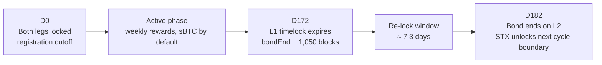
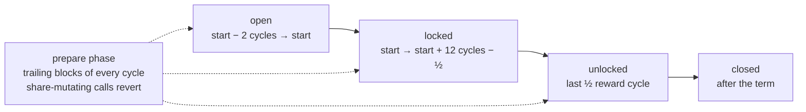
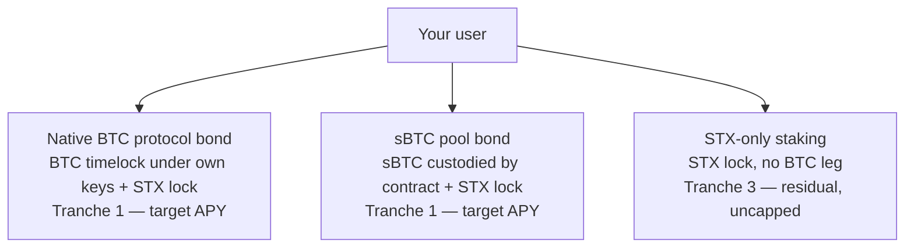

```mermaid
gantt
    title Six bonds overlapping at steady state (new bond every 2 cycles, each runs 12)
    dateFormat X
    axisFormat %s
    section Bond 1
    cycles 0–12 :0, 12
    section Bond 2
    cycles 2–14 :2, 14
    section Bond 3
    cycles 4–16 :4, 16
    section Bond 4
    cycles 6–18 :6, 18
    section Bond 5
    cycles 8–20 :8, 20
    section Bond 6
    cycles 10–22 :10, 22
```

# Concepts

This page is the primer for everything under Development. Read it once and you should know what a bond is, how many exist at any moment, what parameters change per period, and which of the three integration shapes your user is on. The flow pages assume you've internalized this.

## The bond

A [**protocol bond**](glossary.md#protocol-bond) is a six-month, [dual-asset commitment](glossary.md#dual-asset-commitment): a BTC timelock on Bitcoin paired with an STX lock on Stacks. The two legs are cryptographically linked — the Bitcoin script ([P2WSH + CLTV](glossary.md#p2wsh-cltv-l1-timelock-script)) commits to a hash of the participant's [Stacks principal](glossary.md#stacks-principal), and the Stacks contract refuses to register a bond it can't match to a confirmed L1 UTXO via [UTXO matching](glossary.md#utxo-matching). The BTC leg is the yield-bearing asset; the STX leg gates participation and [signing weight](glossary.md#signing-weight) but earns nothing while paired.

|            | BTC leg (Bitcoin L1)                    | STX leg (Stacks L2)                                                                                |
| ---------- | --------------------------------------- | -------------------------------------------------------------------------------------------------- |
| commitment | P2WSH + CLTV timelock                   | contract call                                                                                      |
| custody    | own keys                                | locked in contract                                                                                 |
| duration   | until D172                              | 12 cycles (≈6 months)                                                                              |
| yield      | T1 paired yield                         | none while paired                                                                                  |
| early exit | 1-of-N early-exit signer set (BTC side) | early-exit announcement by the staker (L2 side); sBTC-locked participants can withdraw at any time |

The [static STX:BTC ratio](glossary.md#static-stx-btc-ratio) is fixed per period by the [Endowment](glossary.md#endowment-stacks-endowment) (initially 5%) and published roughly 7 days before D0, alongside the period's capacity and [target APY](glossary.md#apy-target). Check the [ratio requirement](glossary.md#ratio-requirement-minimum-stx-vs-btc) before you submit either leg. The contract rejects an STX lock that is below the period's minimum ratio for the committed BTC.

## One bond's lifetime

Every bond runs the same shape. The [**D0 / D172 / D182**](glossary.md#d0-d172-and-d182-bond-timeline) milestones anchor it: **D0** is the cutoff when both legs must be locked, **D172** is when the L1 timelock expires (≈ 7.3 days before period end on mainnet), **D182** ends the bond on L2 and STX unlocks on the next [cycle boundary](glossary.md#cycle-boundary).

Rewards distribute [weekly](glossary.md#weekly-rewards) throughout the active phase, defaulting to [sBTC](glossary.md#sbtc) via [auto-bridge](glossary.md#auto-bridge-sbtc). The contract keeps reward accounting in two layers, per signer and per staker — the [Rewards](development/rewards.md) page covers how to read and claim them. The [re-lock phase](glossary.md#re-lock-phase) (1,050 burn blocks before bond end on mainnet, ≈ 7.3 days) gives your user time to construct the next L1 timelock without losing continuity. sBTC-locked participants are not gated by the re-lock window and can withdraw at any time. A non-overlapping STX-only stake or an ending bond can also roll directly into a new bond registration or stake without an intervening withdraw — the rollover window opens at the prior bond's L1 unlock.

## Enrollment phases

The D0/D172/D182 view above is the participant's mental model. Code uses the contract's phase vocabulary instead. A bond moves through four phases, anchored to fixed burn heights derived from its bond index:

| Phase        | Span                              | What it means                                                                                                                                       |
| ------------ | --------------------------------- | --------------------------------------------------------------------------------------------------------------------------------------------------- |
| **open**     | `start − 2 cycles` → `start`      | Registration window. The bond setup transaction publishes the bond **and** opens registration in one step — there is no separate "announced" phase. |
| **locked**   | `start` → `start + 12 cycles − ½` | Bond term running, collateral locked. New registrations revert.                                                                                     |
| **unlocked** | last ½ reward cycle of the term   | L1 BTC may unlock (CLTV expiry). The rollover window into the next overlapping bond opens here.                                                     |
| **closed**   | after the term                    | Claim rewards, unlock remaining positions.                                                                                                          |

**`open` does not mean that registration always succeeds.** Two independent clocks overlap. Bond phases are slow and fixed per bond. The PoX reward cycle is fast and global: the last blocks of every cycle are the [prepare phase](glossary.md#prepare-phase-prepare-window), and during the prepare phase the contract rejects [`register-for-bond`](development/paired-btc.md) and the other calls that change stake. An `open` window contains approximately two of these short freezes. To know if registration is possible now, check three conditions: the bond is set up, the bond phase is `open`, and the chain is not in the prepare phase.

(Distinct again, and kept out of lifecycle diagrams: [distribution cycles](glossary.md#distribution-cycle) = half reward cycles, used only for sBTC reward accrual.)

## Six bonds at once

Bonds are staggered monthly: at steady state, six [bonding periods](glossary.md#bonding-period) are running concurrently with new ones opening each [enrollment period](glossary.md#enrollment-period-pox-5) and old ones expiring on the same cadence (a new bond opens every 2 cycles, and each bond runs 12 cycles, so six overlap). "Current period" isn't a single bond — it's whichever bonds are currently active.

A single STX wallet, though, can only sit in **one bond at a time**. `register-for-bond` rejects an enrollment that overlaps an existing membership, so a principal moves from one bond to the next only once the prior bond's term ends (the rollover window). The same Bitcoin wallet(s) can be reused across bonds to construct new timelocks — the one-bond-at-a-time rule is keyed on the **STX principal**, not the BTC keys.

A user can have bond memberships across many periods, but at most one is active at any height. Period state, capacity remaining, and target APY are per-bond, indexed by bond-period.

## One position per principal

PoX-5 enforces a single staking position per Stacks principal at any time, and the two paths are mutually exclusive:

* **You cannot be a bond participant and an STX-only staker simultaneously.** The contract rejects a stake if the principal already has a position, and rejects any membership that overlaps the new position.
* **You cannot be in two concurrent bonds** (see above) — keyed on the STX principal, not the BTC keys.
* Transitioning between paths happens through the **rollover window**: an ending bond or a non-overlapping STX-only stake can roll directly into a new bond registration or stake without an intervening withdraw.

## Per-period parameters

Roughly seven days before each D0, the Endowment publishes the parameters that define the next bond:

* [**Capacity**](glossary.md#available-capacity-and-capacity-allocation-pox-5) — total BTC that can be committed across all participants for that period.
* [**Allocations**](glossary.md#allocation-bond-capacity) — how that capacity splits across whitelisted partners and the [\~10% community tranche](glossary.md#community-tranche-10) (whitelisted pools).
* **STX:BTC ratio** — minimum STX per BTC at lock time, fixed for the period.
* **Target APY** — the rate the program targets for paired BTC; not a guarantee, depends on [miner revenue](glossary.md#miner-bids) and [waterfall](glossary.md#waterfall-yield-distribution) coverage.
* [**Reward asset default**](glossary.md#reward-asset-election) — sBTC via auto-bridge; users can opt out to L1 BTC.

Your app reads these from on-chain state once published; do not hardcode them.

## Three integration paths

Almost every developer surface is one of these three shapes. They differ in who holds what, what gates entry, and where yield comes from in the waterfall.

The first two are paired ([Tranche 1](glossary.md#t1-t2-t3-waterfall-tranches), target APY on the BTC leg). The third earns Tranche 3 residual after T1 obligations and [reserve](glossary.md#reserve-fund-tranche-2) contribution — uncapped, unpaired, lower-friction. Pools and native bonds aren't mutually exclusive for an end-user; an integrator might support multiple from the same UI.

## Prerequisites before any flow

Regardless of path, the flow pages assume these are resolved:

* **Wallet connected**, Stacks principal known.
* [**Allowlist entry confirmed**](glossary.md#whitelist-and-whitelist-row) (native bond only) — the bond's on-chain allowlist must contain the staker, with a sufficient BTC allowance.
* **Signer chosen** — a registered signer with an active key grant, from the [whitelisted signer list](glossary.md#whitelisted-signer-list) (paired paths) or for the user's STX-only stake.
* **Minimum STX satisfied** — the contract requires STX at or above the period's minimum ratio for the committed BTC. Full coverage at the published value is not required; the minimum is a fraction of it, set per bond.
* **SegWit-capable BTC wallet** (native bond only) — the L1 leg locks BTC in P2WSH (SegWit v0) outputs. The wallet must construct these outputs and later spend them.
* **L1 must confirm before L2** for any path that locks BTC on Bitcoin — registration proves the confirmed Bitcoin transaction to the contract.

If any of these isn't satisfied at submission time, the contract or the indexer will reject — the flow pages don't re-cover this ground.
