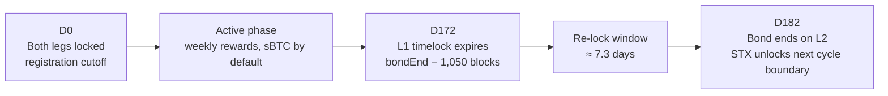
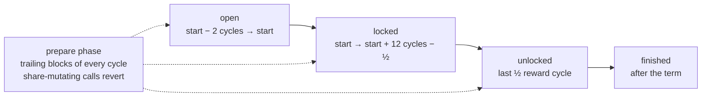
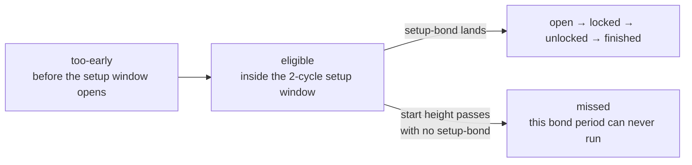
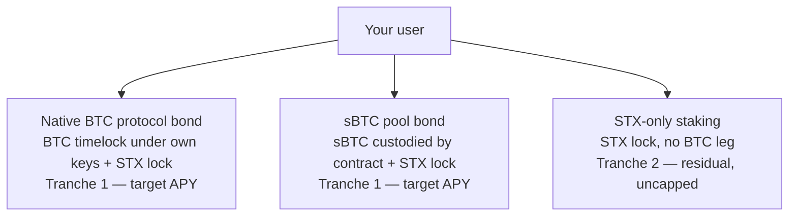

# Concepts

This page is the primer for everything under Development. Read it once and you should know what a bond is, how many exist at any moment, what parameters change per period, and which of the three integration shapes your user is on. The flow pages assume you've internalized this.

## The bond

A [**protocol bond**](glossary.md#protocol-bond) is a six-month, [dual-asset commitment](glossary.md#dual-asset-commitment): a BTC timelock on Bitcoin paired with an STX lock on Stacks. The two legs are cryptographically linked — the Bitcoin script ([P2WSH + CLTV](glossary.md#p2wsh-cltv-l1-timelock-script)) commits to a hash of the participant's [Stacks principal](glossary.md#stacks-principal) (`sha256(sha256(to-consensus-buff(staker)))`), and the Stacks contract refuses to register a bond it can't match to a confirmed L1 UTXO via [UTXO matching](glossary.md#utxo-matching). The BTC leg is the yield-bearing asset; the STX leg gates participation and [signing weight](glossary.md#signing-weight) but earns nothing while paired.

|            | BTC leg (Bitcoin L1)                                                     | STX leg (Stacks L2)                                                                                                                                |
| ---------- | ------------------------------------------------------------------------ | -------------------------------------------------------------------------------------------------------------------------------------------------- |
| commitment | `P2WSH + CLTV` timelock                                                  | `register-for-bond` contract call                                                                                                                  |
| custody    | own keys                                                                 | locked in contract                                                                                                                                 |
| duration   | until D172                                                               | 12 cycles (≈6 months)                                                                                                                              |
| yield      | T1 paired yield                                                          | none while paired                                                                                                                                  |
| early exit | early-exit signer set (BTC side), per-bond `early-unlock-bytes` template | `announce-l1-early-exit` callable directly by the staker (L2 side); sBTC-locked participants use `unstake-sbtc` any time outside the prepare phase |

The [static STX:BTC ratio](glossary.md#static-stxbtc-ratio) is fixed per period by the [Endowment](glossary.md#endowment-stacks-endowment) (initially 5%) and published roughly 7 days before D0, alongside the period's capacity and [target APY](glossary.md#apy-target). Your integration must check the [ratio requirement](glossary.md#ratio-requirement-minimum-stx-vs-btc) before submitting either leg — the contract will reject an STX lock that doesn't cover the BTC committed at the published price.

## One bond's lifetime

Every bond runs the same shape. The [**D0 / D172 / D182**](glossary.md#d0-d172-and-d182-bond-timeline) milestones anchor it: **D0** is the cutoff when both legs must be locked, **D172** is when the L1 timelock expires (≈ 7.3 days before period end on mainnet, set by `get-bond-l1-unlock-height` to `bondEndHeight − pox-reward-cycle-length/2` = 1,050 blocks), **D182** ends the bond on L2 and STX unlocks on the next [cycle boundary](glossary.md#cycle-boundary).



Rewards distribute [weekly](glossary.md#weekly-rewards) throughout the active phase, defaulting to [sBTC](glossary.md#sbtc) via [auto-bridge](glossary.md#auto-bridge-sbtc). On-chain, accounting runs in two parallel layers — per-signer and per-staker — and per [distribution cycle](glossary.md#distribution-cycle): [`settle-rewards`](glossary.md#settle-rewards) settles the signer layer into `signer-unclaimed-rewards-for-cycle` and snapshots `signer-rewards-per-token-settled-for-cycle`, and `settle-staker-rewards` settles the staker layer one level down (`staker-unclaimed-rewards-for-cycle`, `staker-rewards-per-token-settled-for-cycle`). The single number a UI should display comes from [`get-earned`](glossary.md#get-earned) (signer) or `get-earned-staker-rewards` (per-staker). The [re-lock phase](glossary.md#re-lock-phase) (1,050 burn blocks before bond end on mainnet, ≈ 7.3 days) exists so your user has time to construct the next L1 timelock without losing continuity — most renewal UX lives in this window. sBTC-locked participants are not gated by the re-lock window and can withdraw via [`unstake-sbtc`](glossary.md#unstake-sbtc) at any time outside the prepare phase (`ERR_STAKE_IN_PREPARE_PHASE u47`). A non-overlapping STX-only stake or an ending bond can also be rolled directly into a new `register-for-bond` or `stake` call without an intervening withdraw — the rollover window opens at the prior bond's L1 unlock.

## Enrollment phases

The D0/D172/D182 view above is the _participant's_ mental model. When you're writing code or UI that asks "can this user enroll right now?", use the contract's phase vocabulary instead. A bond moves through four phases, anchored to fixed burn heights derived from its `bond-index`:



| Phase        | Span                              | What it means                                                                                                                                                                                                                                     |
| ------------ | --------------------------------- | ------------------------------------------------------------------------------------------------------------------------------------------------------------------------------------------------------------------------------------------------- |
| **open**     | `start − 2 cycles` → `start`      | Registration window. `setup-bond` publishes the bond **and** opens registration in one step — there is no separate "announced" phase. The window spans the contract's full 2-cycle setup gap (`BOND_GAP_CYCLES`).                                 |
| **locked**   | `start` → `start + 12 cycles − ½` | Bond term running, collateral locked. New registrations revert (`ERR_BOND_ALREADY_STARTED`).                                                                                                                                                      |
| **unlocked** | last ½ reward cycle of the term   | L1 BTC may unlock (CLTV expiry) — `get-bond-l1-unlock-height` is the earliest each output's committed `unlock-burn-height` is allowed to be, and the start of the rollover window (`verify-bond-rollover-window`) into the next overlapping bond. |
| **finished** | after the term                    | Claim rewards, unlock remaining positions.                                                                                                                                                                                                        |

The catch the diagram makes visible: **`open` does not mean registration always succeeds.** Two independent clocks overlap. Bond phases are slow (per `bond-index`, fixed heights). The PoX reward cycle is fast and global — the trailing `prepareCycleLength` blocks of _every_ cycle are the [prepare phase](glossary.md#prepare-phase-prepare-window), during which every share-mutating entrypoint reverts — `register-for-bond`, `update-bond-registration`, `stake`, `stake-update`, `announce-l1-early-exit`, and `unstake-sbtc` all raise `ERR_STAKE_IN_PREPARE_PHASE`, and `unstake` raises the separate `ERR_UNSTAKE_IN_PREPARE_PHASE`. A \~2-cycle `open` window therefore contains \~2 prepare freezes where registration is blocked even though the bond is still `open`. The rule to gate UI on:

```
can_register = bond is set up
             AND phase == 'open'          // configured AND height < start
             AND NOT is-in-prepare-phase  // not inside the periodic freeze
```

Render prepare phase as a recurring badge or hatch cutting across the bond timeline — not as its own lifecycle stage. (Distinct again, and kept out of lifecycle diagrams: [distribution cycles](glossary.md#distribution-cycle) = half reward cycles, used only for sBTC reward accrual.)

### Statuses before a bond is configured

`open`/`locked`/`unlocked`/`finished` describe a bond whose `get-protocol-bond` entry exists. Before the Endowment calls `setup-bond` the entry is `none`, and a point-in-time status read carries one of three extra labels:



* **too-early** — before the setup window opens; `setup-bond` would revert (`ERR_CANNOT_SETUP_BOND_TOO_SOON`).
* **eligible** — inside the 2-cycle setup window; the admin _can_ call `setup-bond` now, but stakers still can't register until it lands.
* **missed** — the start height passed without a `setup-bond` call; that bond period can never run.

Because the admin may call `setup-bond` anywhere inside the eligible window, the `open` window's real start is the **setup transaction's block**, not a fixed offset — derive it from the bond's existence (`get-protocol-bond`), not from a schedule.

### Which leg, under which conditions

Registration commits one BTC leg, chosen at `register-for-bond` time and fixed for the term:

| Leg        | `btc-lockup`        | At registration                                                                                                                                                                                                                                                                                                                                                  | During the term                                                                                                           |
| ---------- | ------------------- | ---------------------------------------------------------------------------------------------------------------------------------------------------------------------------------------------------------------------------------------------------------------------------------------------------------------------------------------------------------------- | ------------------------------------------------------------------------------------------------------------------------- |
| **L1 BTC** | `ok { outputs, … }` | SPV-prove each timelock UTXO (up to 10); each output commits its own `unlock-burn-height` — any height `≥` the bond's minimum L1 unlock height (`get-bond-l1-unlock-height`) — and its script is reconstructed and matched per-output (`validate-l1-lockup`). An `unlock-burn-height` below the minimum reverts (`ERR_INVALID_UNLOCK_HEIGHT`). No sBTC custodied | each output unlocks at its committed `unlock-burn-height` (no earlier than the bond's minimum, i.e. the `unlocked` phase) |
| **sBTC**   | `err sbtcSats`      | contract transfers the sBTC delta in (`roll-sbtc`)                                                                                                                                                                                                                                                                                                               | withdraw any time outside the prepare phase via `unstake-sbtc` — not gated by the rollover window                         |

Beyond the phase gates, every `register-for-bond` also checks: the staker is on the bond's allowlist, `sats-total ≤ max-sats`, `amount-ustx` meets the minimum for that BTC at the bond's ratio, the chosen signer is registered with an active key grant, and no overlapping STX-only stake or bond membership exists. See Paired BTC for the full enrollment flow.

## Six bonds at once

Bonds are staggered monthly: at steady state, six [bonding periods](glossary.md#bonding-period) are running concurrently with new ones opening each [enrollment period](glossary.md#enrollment-period-pox-5) and old ones expiring on the same cadence (a new bond opens every `BOND_GAP_CYCLES` = 2 cycles, and each bond runs 12 cycles, so six overlap). "Current period" isn't a single bond — it's whichever bonds are currently active.

A single STX wallet, though, can only sit in **one bond at a time**. `register-for-bond` rejects an enrollment that overlaps an existing membership (`ERR_ALREADY_REGISTERED`), so a principal moves from one bond to the next only once the prior bond's term ends (the rollover window). The same Bitcoin wallet(s) can be reused across bonds to construct new timelocks — the one-bond-at-a-time rule is keyed on the **STX principal**, not the BTC keys.

```mermaid
gantt
    title Six bonds overlapping at steady state (new bond every 2 cycles, each runs 12)
    dateFormat X
    axisFormat %s
    section Bond 1
    cycles 0–12 :0, 12
    section Bond 2
    cycles 2–14 :2, 14
    section Bond 3
    cycles 4–16 :4, 16
    section Bond 4
    cycles 6–18 :6, 18
    section Bond 5
    cycles 8–20 :8, 20
    section Bond 6
    cycles 10–22 :10, 22
```



For most read-only surfaces, you'll iterate over a user's bond memberships across periods, but expect at most one active at any height. Period state, capacity remaining, and target APY are per-bond, indexed by bond-period.

## One position per principal

PoX-5 enforces a single staking position per Stacks principal at any time, and the two paths are mutually exclusive:

* **You cannot be a bond participant and an STX-only staker simultaneously.** `stake` reverts with `ERR_ALREADY_STAKED` if the principal already has a position, and `register-for-bond` / `stake` reject any membership that overlaps the new position.
* **You cannot be in two concurrent bonds** (see above) — keyed on the STX principal, not the BTC keys.
* Transitioning between paths happens through the **rollover window**: an ending bond or a non-overlapping STX-only stake can roll directly into a new `register-for-bond` or `stake` call without an intervening withdraw.

## Per-period parameters

Seven days before each D0, the Endowment publishes the parameters that define the next bond:

* [**Capacity**](glossary.md#available-capacity-and-capacity-allocation-pox-5) — total BTC that can be committed across all participants for that period.
* [**Allocations**](glossary.md#allocation-bond-capacity) — how that capacity splits across whitelisted partners and the [\~10% community tranche](glossary.md#community-tranche-10) (whitelisted pools).
* **STX:BTC ratio** — minimum STX per BTC at lock time, fixed for the period.
* **Target APY** — the rate the program targets for paired BTC; not a guarantee, depends on [miner revenue](glossary.md#miner-bids) and [waterfall](glossary.md#waterfall-yield-distribution) coverage.
* [**Reward asset default**](glossary.md#reward-asset-election) — sBTC via auto-bridge; users can opt out to L1 BTC.

Your app reads these from on-chain state once published; do not hardcode them.

## Three integration paths

Almost every developer surface is one of these three shapes. They differ in who holds what, what gates entry, and where yield comes from in the waterfall.



The first two are paired ([Tranche 1](glossary.md#t1-t2-t3-waterfall-tranches), target APY on the BTC leg). The third earns Tranche 2 residual after T1 obligations, ahead of the [reserve](glossary.md#reserve-fund-tranche-3) contribution — uncapped, unpaired, lower-friction. Pools and native bonds aren't mutually exclusive for an end-user; an integrator might support multiple from the same UI.

## Prerequisites before any flow

Regardless of path, the flow pages assume these are resolved:

* **Wallet connected**, Stacks principal known.
* [**Whitelist row resolved**](glossary.md#whitelist-and-whitelist-row) (native bond only) — `Allocated`, `Pending`, or `Not whitelisted`.
* **Signer chosen** from the [whitelisted signer list](glossary.md#whitelisted-signer-list) (paired paths) or for the user's STX-only stake.
* **Ratio satisfied** — paired STX covers the BTC commitment at the published ratio.
* [**Reward address**](glossary.md#reward-address) known and editable (default: connected wallet).
* **L1 must confirm before L2** for any path that locks BTC on Bitcoin.

If any of these isn't satisfied at submission time, the contract or the indexer will reject — the flow pages don't re-cover this ground.
