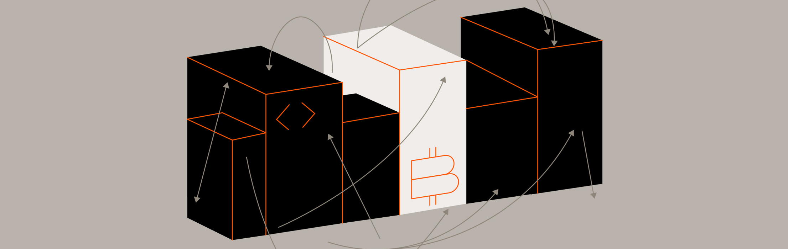

# Introduction

<figure><figcaption></figcaption></figure>

The Reference section of the Stacks docs provides detailed, comprehensive information about Stacks' programming languages, devtools, and APIs. This includes syntax definitions, API details, data structures, and function descriptions. It serves as a vital resource for developers seeking specific technical details or clarifications while building applications on the Stacks blockchain.

If you’re an experienced Stacks developer looking to quickly reference a specific method, type, or API response, this section is built for fast lookup and precision.

***

### Looking for references on...

<table data-card-size="large" data-view="cards"><thead><tr><th></th><th></th></tr></thead><tbody><tr><td><h4>APIs</h4></td><td>Endpoints for interacting with Stacks nodes, signers, sBTC bridge, and the USDCx bridge</td></tr><tr><td><h4>Clarity</h4></td><td>Definitions for types, functions, and keywords</td></tr><tr><td><h4>Clarinet</h4></td><td>CLI commands for developing and deploying contracts</td></tr><tr><td><h4>Clarinet JS SDK</h4></td><td>Test and simulate contracts in JavaScript</td></tr><tr><td><h4>Rendezvous</h4></td><td>Property-based testing and fuzzing for Clarity</td></tr><tr><td><h4>Stacks.js</h4></td><td>Definitions for functions and types when building frontends</td></tr></tbody></table>
