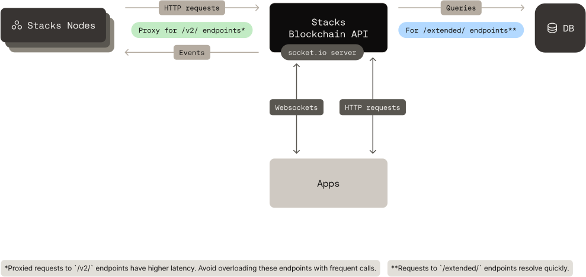

# Architecture

Hiro builds and maintains the Stacks Blockchain API. Hiro's documentation is the source of truth for its design, endpoints and deployment. For the full architecture, see [Stacks Blockchain API architecture](https://docs.hiro.so/apis/stacks-blockchain-api/architecture) on docs.hiro.so and the [source repository](https://github.com/hirosystems/stacks-blockchain-api).

## How it works

* **Ingests events from a Stacks node.** A Stacks node sends blocks, transactions and their byproducts (asset transfers, contract events, execution costs) to the API's event observer.
* **Stores them in PostgreSQL.** The API indexes that data so it can answer questions a node cannot serve efficiently, such as an account's transaction history.
* **Serves indexed data under `/extended`.** These are the API's own endpoints.
* **Proxies node RPC under `/v2`.** Requests to `/v2` paths go straight to the Stacks node's RPC endpoints. For those endpoints, see the [Stacks Node RPC reference](../stacks-node-rpc/).
