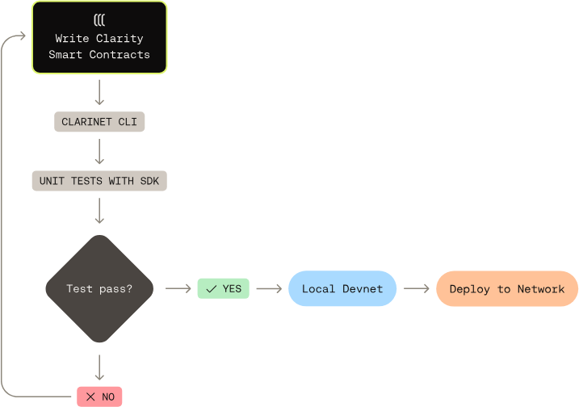

# Overview

Clarinet is the fastest way to build, test, and deploy smart contracts on the Stacks blockchain. It gives you a local devnet, REPL, testing framework, and debugging tools to ship high-quality Clarity code with confidence.

<div data-with-frame="true"><figure><figcaption></figcaption></figure></div>

## Key features

* [**Leverage a powerful CLI**](cli-reference.md) - Create new projects, manage your smart contracts and their dependencies using clarinet requirements, and interact with your code through the built-in REPL.
* [**Write unit tests with the SDK**](../clarinet-js-sdk/unit-testing.md) - Use the Clarinet SDK to write unit tests in a familiar JS environment and validate contract behavior.
* [**Run a private blockchain environment**](local-blockchain-development.md) - Spin up a local devnet with nodes, miners, and APIs so you can test and integrate your code.
* [**VSCode extension**](../clarinet-integrations/vscode-extension.md) - Linter, step by step debugger, helps writing smart contracts (autocompletion, documentation etc).

## Installation



```bash
brew install clarinet
```



```bash
winget install clarinet
```



```bash
sudo apt install build-essential pkg-config libssl-dev
git clone https://github.com/hirosystems/clarinet
cd clarinet
cargo clarinet-install
```



```bash
wget -nv https://github.com/hirosystems/clarinet/releases/latest/download/clarinet-linux-x64-glibc.tar.gz -O clarinet-linux-x64.tar.gz
tar -xf clarinet-linux-x64.tar.gz
chmod +x ./clarinet
mv ./clarinet /usr/local/bin
```



## Networks

Clarinet supports different network types to cater to various development and testing needs:

| Network   | Description                                                                 | Use case                                                           |
| --------- | --------------------------------------------------------------------------- | ------------------------------------------------------------------ |
| `simnet`  | Optimized for fast feedback loops, introspection, and portability.          | Ideal for initial development and unit-testing.                    |
| `devnet`  | Local Stacks and Bitcoin nodes running on Docker for faster feedback loops. | Use for integration tests or local frontend development.           |
| `testnet` | A pre-production network that offers a realistic environment for testing.   | Ideal for final testing before deploying to Mainnet.               |
| `mainnet` | The production network where real transactions occur.                       | Use when you're ready to deploy your smart contract to production. |



Help: Need help building with Clarinet?

Reach out to us on the **#clarinet** channel on [Discord](https://stacks.chat/) under the Developer Tools section.

