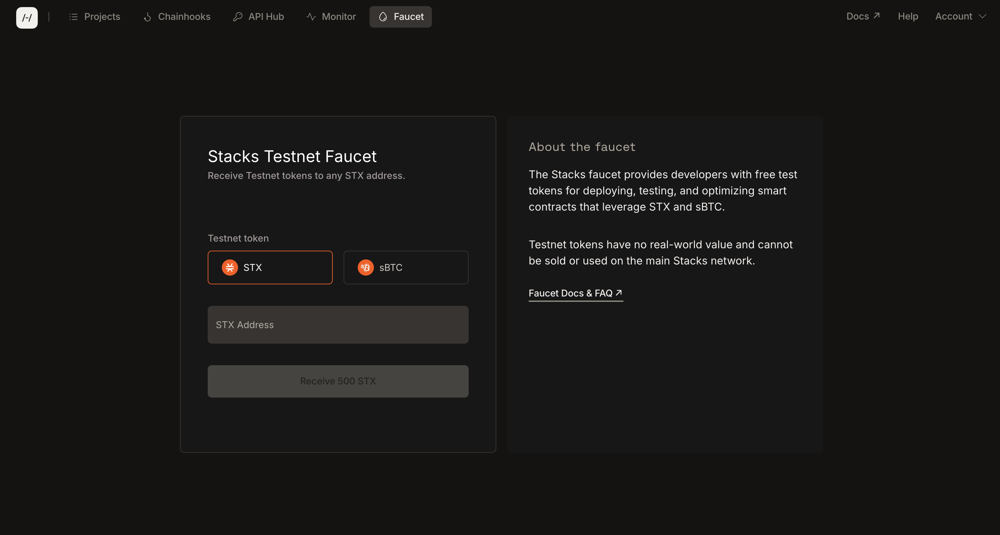

# Initial Setup

### Set Up Your Wallet

In order to continue, you'll need to have a web wallet in order to interact with the app we'll be creating.

Download and set up [Leather](https://leather.io/) or [Xverse](https://www.xverse.app/). This is how we'll be interacting with our dapp. If you've ever used Metamask, they are very similar.

We'll be using Leather throughout the course, but the process is similar for both.

After you get the wallet set up, you'll want to get some testnet STX and sBTC.

For both, you can use the faucet within the Hiro Platform.

### Hiro Platform

Hiro is a developer tool company building developer tools for Stacks and Bitcoin. One of their main tools is the [Hiro Platform](https://www.hiro.so/platform), a suite of tools to build complete apps on Bitcoin. We'll be using it extensively throughout the rest of the course.

The first thing you'll want to do is [sign up for an account](https://platform.hiro.so/) and get some testnet STX and sBTC via the faucet within the platform.

<figure><figcaption></figcaption></figure>

After you have your wallet and testnet coins, you're ready to start building.

If you aren't familiar with how Stacks works, you'll want to take a few minutes to learn the basics over in the [Stacks 101](https://app.gitbook.com/s/kmQRCSAss8rGMUFc587c/concepts/stacks-101) section of the docs.

That will walk you through the basics of how Stacks actually operates. Then you can come back here and get building.

### Your Dev Environment

Your developer environment is largely a personal choice, but you'll need some basics to proceed with the rest of this course.

### Code Editor

You'll need a code editor, ideally VS Code or a fork of it. We'll be using [Cursor](https://cursor.com) throughout this tutorial and we'll be heavily embracing and using AI-assisted coding throughout.

Hiro has also created a Clarity VS Code extension which makes it much easier to work with Clarity code in our projects.

### Terminal

You'll also want a terminal of some kind. You can use the built-in terminal provided by Cursor or you can download a standalone termainl such as [Warp](https://warp.dev).

### Node

We'll be making heavy use of Node, npm, and JavaScript in this course, so make sure you have Node and NPM installed on your machine.

As of this writing I am using Node version 22.14.0 and NPM version 10.9.2.

### Video Walkthrough

Here's a brief video walking you through setting up a new wallet and getting some initial test STX and sBTC from the Hiro Platform faucet.


