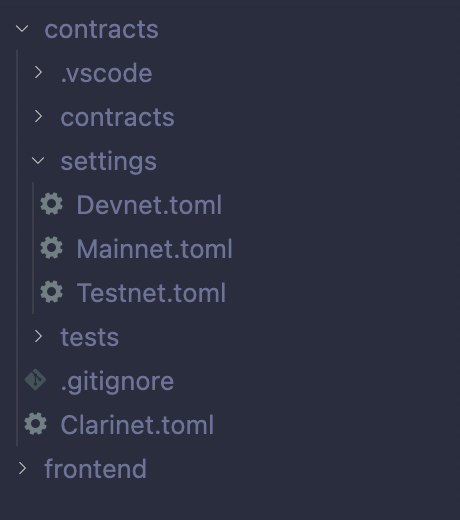
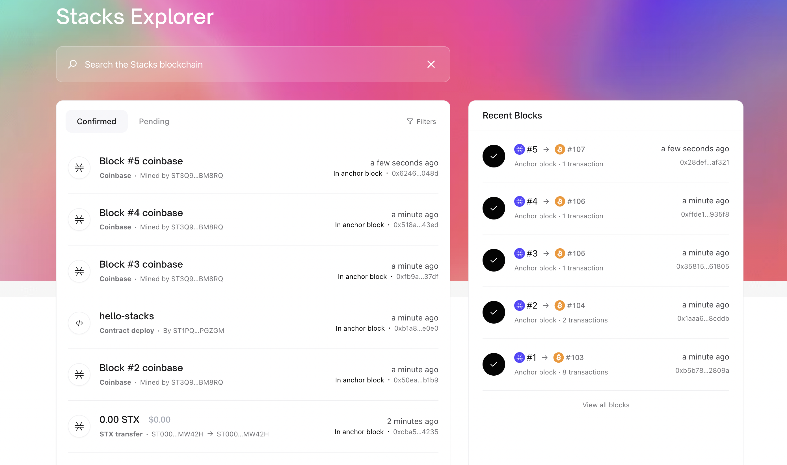
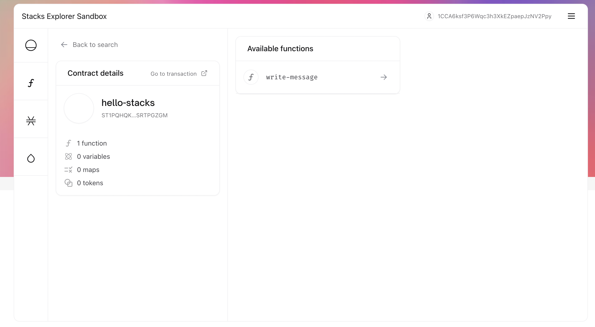
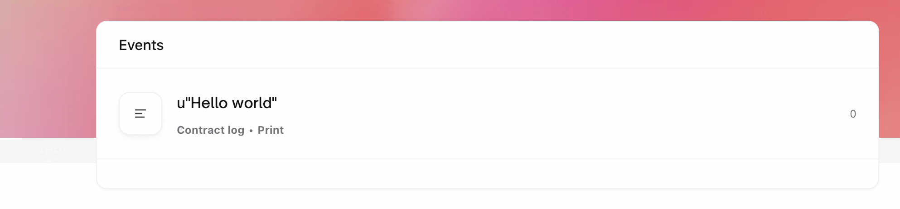
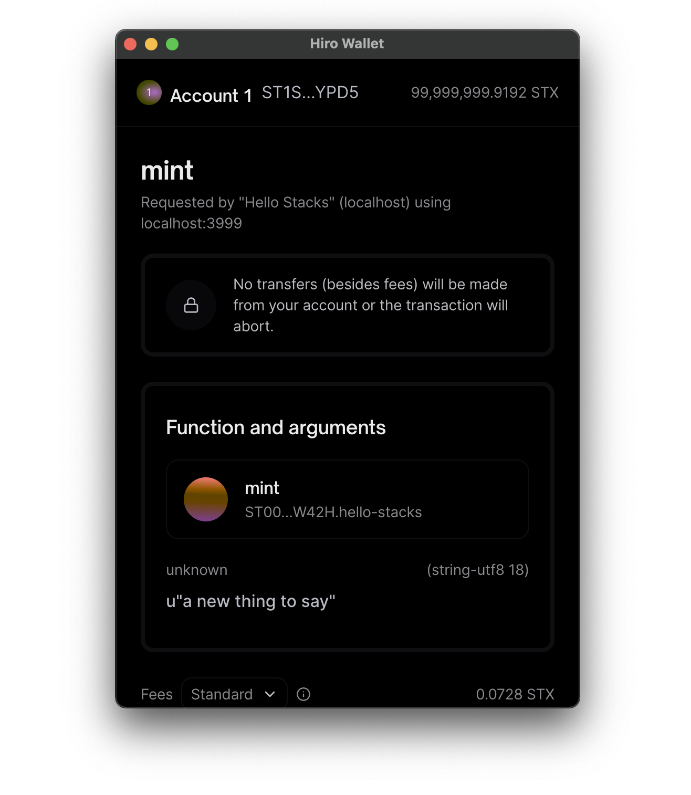
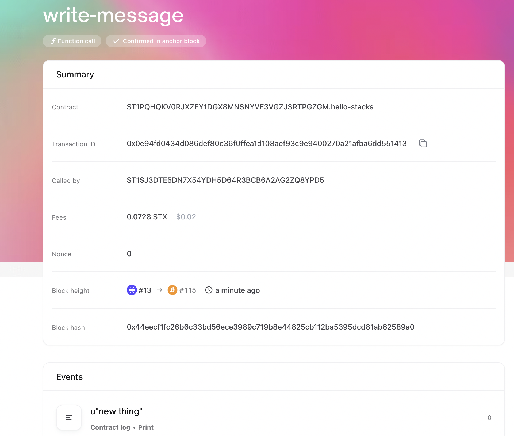

# Hello Stacks (Quickstart Tutorial)
Looking to see what building on Stacks is all about? You're in the right place.

This tutorial is designed to take you from never having worked with Stacks before to a complete app in about an hour.

You'll be introduced to all the main concepts and tools utilized to build Stacks dapps, with further resources to continue to learn.

It does assume a basic familiarity with blockchain and smart contract technology. If you need an intro to those things, we recommend Codecademy's [Intro to Blockchain and Crypto](https://www.codecademy.com/learn/introduction-to-blockchain-and-crypto) course to get up to speed.

Let's get started.

## What We're Building
We're going to be building a very simple practice application called Hello Stacks. Hello Stacks allows users to post a message to the Stacks blockchain and automatically generates a link for others to view that message.

Here's a brief overview video of what it looks like.

We'll be utilizing various tools throughout this tutorial, most of which you don't need to have prior experience with.

It will be helpful, however, for you to be familiar with JavaScript and React to be able to most effectively follow along, as that's what we're going to be using to build the frontend, along with [Vite](https://vitejs.dev/).

You can either follow along from scratch starting in the next section, or you can download the [starter repo](https://github.com/kenrogers/hello-stacks/tree/starter-branch) with all of the dependencies already set up on GitHub.

You can also view the finished code in the `master` branch of that same repo.

Let's get started by getting everything set up.

## Wallet Setup
The very first thing you'll need to do is set up the Hiro wallet extension. This is how you can get STX tokens and interact with Stacks dapps. All you need to do right now is visit Hiro's [wallet page](https://wallet.hiro.so/) and install it. We'll set it up later with our dev environment.

## Code Setup
If you want to use the starter repo, you can clone that, run `yarn` and move on to the next section, titled '[Writing Our Smart Contract](#writing-our-smart-contract)'.

Otherwise, follow along if you want to start from scratch. If you are brand new to Stacks and are not familiar with the tooling ecosystem like Clarinet, Stacks.js, etc. I highly recommend following along to get everything set up on your own.

:::tip
Hiro also has a set of [Stacks.js starters](https://docs.hiro.so/stacksjs-starters) that you can use to quickly get up and running with a new Stacks project. We won't be using them here, but they are an excellent resource.
:::

The first thing we need to do is scaffold a new project with Vite, the frontend build tool we'll be using.

We're going to be using [Yarn](https://yarnpkg.com/), but you can also use NPM if you prefer. I'm using Yarn version `1.22.19` for this project and running Node version 18.7.0. You'll need to have both of those installed to follow along. I'm also working on a Mac, but will provide alternative installation instructions for tools like Clarinet as we go.

:::tip
We recommend [installing and using NVM](https://github.com/nvm-sh/nvm) in order to install Node and easily switch versions.
:::

We'll have two separate directories for our project, one to handle the smart contracts and one to handle the frontend. Let's start by creating that and changing into it.

```bash
mkdir hello-stacks && cd hello-stacks
```

Then get our frontend scaffolded.

```bash
yarn create vite frontend --template react
```

Next we are going to install Clarinet. Clarinet is a development environment for Stacks created by Hiro. It allows us to set up a local Stacks chain, easily work with Clarity smart contracts (covered next), deploy our contracts, and test them. You can think of it as similar to Hardhat in the Ethereum world.

Installation instructions vary depending on your system, so I'll refer you to the [Clarinet documentation](https://github.com/hirosystems/clarinet) to get that installed, then come back here to set up our project.

Still inside the `hello-stacks` directory, let's get our Stacks folder created with the following command. You can name this whatever you want, but I like the frontend/contracts convention.

```bash
clarinet new contracts
```

After this, you should have a `contracts` directory in your project that looks like this.



There's not much here yet, we'll be creating our contracts in the next section. You'll also see a folder for tests, which are not covered in this tutorial.

:::note
Some people don't like the `contracts/contracts` structure that results from this naming convention. It's a matter of personal preference what you want to name this top-level folder when you create the Clarinet project.
:::

Finally, there is a directory called `settings` which contains a few configuration files for how we can interact with each chain. We are primarily concerned with `Devnet.toml` here, as this is how we can set up our local Stacks node for testing purposes. The others mainly come into play when we deploy.

The `Clarinet.toml` file also provides some configuration options for our smart contracts and Clarinet will add our contracts here when we create them.

:::tip
Hiro has created an excellent [Clarinet 101](https://www.youtube.com/playlist?list=PL5Ujm489LoJaAz9kUJm8lYUWdGJ2AnQTb) series on YouTube for getting up to speed on everything Clarinet has to offer.
:::

Now we need to install some dependencies for working with Stacks and for styling so our app looks halfway decent. I'm a big fan of Tailwind, so we'll be utilizing that in this tutorial.

Let's get Tailwind installed. We'll need some additional packages from Stacks.js as well, but we'll install those as we go. First make sure you are in the `frontend` directory and install the necessary dependencies for Tailwind.

```bash
yarn add -D tailwindcss postcss autoprefixer
```

and initialize it with

```bash
npx tailwindcss init -p
```

Now we need to tell Tailwind where our content is coming from and change out processing mode to "Just-In-Time" by modifying the `tailwind.config.js` file to look like this.

```js
/** @type {import('tailwindcss').Config} */
module.exports = {
  mode: 'jit',
  content: [
    "./index.html",
    "./src/**/*.{js,ts,jsx,tsx}",
  ],
  theme: {
    extend: {},
  },
  plugins: [],
}
```

Add the Tailwind directvies to the `index.css` file.

```css
@tailwind base;
@tailwind components;
@tailwind utilities;
```

Now we need to modify our `App.jsx` file to make sure Tailwind is working.

```js
function App() {
  return (
    <div className="flex justify-center items-center h-screen">
        <h1 className="text-3xl">Hello Stacks</h1>
    </div>
  )
}

export default App
```

You can also delete the `App.css` file.

Now run `yarn dev` and make sure everything is working. Your screen should look like this.


Awesome! We have our set up out of the way, now we can start actually coding. We're going to start with our smart contract and learn a bit about Clarity in the process.

## Writing Our Smart Contract
Clarity is a smart contract language that has been purpose-built to help developers write safe, secure smart contracts.

It took a lot of the lessons learned from the Solidity hacks over the years and used them to create something much more secure and safe.

Stacks smart contracts are written using Clarity and live on the Stacks chain. For a comprehensive introduction to writing Clarity contracts, I highly recommend the book, [Clarity of Mind](https://book.clarity-lang.org/). We'll go over the basics here as we write a simple smart contract, but we are only scratching the surface.

Before we do that, take a minute to familiarize yourself with what makes Clarity unique and why you might want to build on it by reading just the [Introduction chapter](https://book.clarity-lang.org/ch00-00-introduction.html) of Clarity of Mind.

Now that you understand why Clarity is useful, let's get started writing our first contract and go over some Clarity concepts along the way.

The first thing we need to do is generate our new smart contract with Clarinet. Make sure you are in the top level `contracts` folder and generate that.

```bash
clarinet contract new hello-stacks
```

That created a few things for us. First, it created a `hello-stacks_test.ts` file in the `tests` directory. This is how we can use Clarinet to test our smart contracts. We won't cover that here, but you can check out the [TDD with Clarinet](https://dev.to/stacks/test-driven-stacks-development-with-clarinet-2e4i) tutorial for more information on that.

It also created our actual Clarity file, `hello-stacks.clar` inside the inner `contracts` directory. This is where we'll actually write our smart contract.

:::tip
If you use VS Code, be sure to install the [Clarity Extension](https://marketplace.visualstudio.com/items?itemName=HiroSystems.clarity-lsp#:~:text=Clarity%20is%20a%20decidable%20Smart,safety%20checks%2C%20debugger%20and%20more.) for a more enjoyable Clarity developer experience.
:::

If you open up the `Clarinet.toml` file, you'll also see that Clarinet added our new contract there.

Now let's open up that `hello-stacks.clar` file and get writing our contract.

You'll see that it set up a bit of a template we can use, with each section commented out. This is a good introduction to some of the common data structures and functions we'll be using in a Clarity contract.

But we can delete it for now as we'll be writing our own and covering what each does along the way.

Let's look at the very basic completed Clarity smart contract, then we'll go over what each line does.

```
(define-public (write-message (message (string-utf8 500)))
    (begin
        (print message)
        (ok "Message printed")
    )
)
```

All we are doing here is defining a new public function called `write-message`. Public means that we can call this function from anywhere, as opposed to private, which would mean only this contract could call it.

Whenever we call this function, we need to pass it a `message` which is a UTF8 string with a maximum of 500 characters.

Next we see a block called `begin`. In Clarity, everything is a list inside of a list, so in this function definition, what we are really doing is calling the `define-public` function and passing it to arguments.

The first is the function signature, which contains the name and the arguments.

The second argument is the body of the function, but this can only contain a single expression. By wrapping our function body in a `begin` block, we can pass a multi-step function as a single expression.

Again, there is much more information on how Clarity works in the [Clarity Book](https://book.clarity-lang.org/), this is just a high-level introduction to get you familiar.

Within this `begin` block we are doing two things. First we are pringing the contents of our message to the blockchain, this will actually post the contents of this message to the chain when we send this transaction, something we'll look at soon.

Then we are returning a response of `ok`, indicating success, with the message "Message printed".

Clarity requires return values in all functions. In more complex functions, we would return either a success or error message depending on what action was taken and other logic.

We can test this right now using the Clarinet console. In the `contracts` folder, run `clarinet console` to open it up and write the following:

```bash
(contract-call? .hello-stacks write-message u"Hello there")
```

Here we are calling the function we just created and passing a message of "Hello there". We prifix that with a `u` to indicate this is a UTF8 string.

You should get an `ok` message returned here, which indicates that our function was called successfully.

## Running a Local Stacks Devnet
One of the coolest features of Clarinet is that it allows us to set up an entire mock Stacks network on our local machine for testing.

This comes complete with a local block explorer and sandbox environment so we can further test our contracts.

Make sure you have Docker installed and running, exit out of console with `CMD/CTRL + C` and run `clarinet integrate`.

It will take a few minutes to get up and running, but then we can open up our local Stacks block explorer.

:::note
You can [view the live Stacks block explorer](https://explorer.stacks.co/?chain=mainnet) and switch between mainnet and testnet to get familiar with it.
:::

Once it finishes, visit the local block explorer at `localhost:8000`. You'll be able to see blocks as they are created and also see your `hello-stacks` contract deployment.

Click on that and copy the contract name, we'll need it for the next step.



Now go ahead and visit the sandbox by clicking on the 'Sandbox' link up at the top. You'll need to connect with your wallet to use it, but we can also interact with our contract here.

Be sure to change your network to `Devnet` in your Hiro wallet, then connect.

:::caution
If you run into funky rendering issues, be sure to change the network URL parameter in the address bar to `testnet`.
:::

Click on the little function symbol on the left and take the contract name you copied and paste it in the top field there, the name should be automatically populated.

Hit 'Get Contract' and you should see the function we created there.



Now we can click on that and type in a message to call the function. But if you try to do that now, you might get an error saying you don't have enough STX.

How do we get STX tokens in our Devnet account? Remember that `Devnet.toml` file Clarinet generates? That determines what accounts have what tokens.

So now we need to set up our Hiro wallet extension that we set up at the beginning of this tutorial. If you already have an existing Hiro wallet, you'll need to sign out in order to use it with the local Clarinet Devnet.

:::warning
Make sure you copy your secret key before you sign out. You'll need it to restore your Hiro wallet when you are done developing.
:::

Go ahead and copy the mnemoic listed in the `Devnet.toml` file and use that to import your local wallet into the Hiro wallet. Then we can use that for interacting with our local Devnet chain.

Once you do that, go ahead and restart `clarinet integrate`.

Now we can go back to the sandbox and call that function. You might need to sign out of the sandbox first and reauthenticate.

When we do, you'll see the Hiro wallet pop up with a transaction confirmation. You'll also see a little notice at the top that no transfers besides fees will occur.

This is a cool feature of Stacks called Post Conditions. They are outside the scope of this tutorial, but you can learn more about them in the [Understanding Stacks Post Conditions](https://dev.to/stacks/understanding-stacks-post-conditions-e65) tutorial. They are another safety feature to help protect users.

Now we can go back to the 'Transactions' page, click on this transaction, and see the data that was written to the chain.

Here you can see a lot of information about the transaction, including the fact that a print event was detected, and what content was printed.



Let's get our frontend set up so we can see how to do this with a UI and also read this information from the chain.

## Adding a UI
For this tutorial, we'll be using [Stacks.js](https://www.hiro.so/stacks-js), a JS library from Hiro that helps us interact with the Stacks chain, our Hiro wallet, and our contracts. Another option is [Micro-Stacks](https://micro-stacks.dev/), a community-created resource.

Since this is not a React tutorial, I'm going to give you all the boilerplate at once so you can just copy and paste this into `App.jsx` and we'll add the Stacks-specific stuff together.

```jsx
import { useState } from "react";

function App() {
  const [message, setMessage] = useState("");
  const [transactionId, setTransactionId] = useState("");
  const [currentMessage, setCurrentMessage] = useState("");

  const connectWallet = () => {
    // implement code
  };

  const handleMessageChange = (e) => {
    setMessage(e.target.value);
  };

  const submitMessage = () => {
    // submit transaction
  };

  const handleTransactionChange = (e) => {
    setTransactionId(e.target.value);
  };

  const retrieveMessage = () => {
    // submit transaction
  };

  return (
    <div className="flex flex-col justify-center items-center h-screen gap-8">
      <button
        className="p-4 bg-indigo-500 rounded text-white"
        onClick={connectWallet}
      >
        Connect Wallet
      </button>
      <h1 className="text-6xl font-black">Hello Stacks</h1>
      <div className="flex gap-4">
        <input
          className="p-4 border border-indigo-500 rounded"
          placeholder="Write message here..."
          onChange={handleMessageChange}
          value={message}
        />
        <button
          className="p-4 bg-indigo-500 rounded text-white"
          onClick={submitMessage}
        >
          Submit New Message
        </button>
      </div>
      <div className="flex gap-4">
        <input
          className="p-4 border border-indigo-500 rounded"
          placeholder="Paste transaction ID to look up message"
          onChange={handleTransactionChange}
          value={transactionId}
        />
        <button
          className="p-4 bg-indigo-500 rounded text-white"
          onClick={retrieveMessage}
        >
          Retrieve Message
        </button>
      </div>
      {currentMessage.length > 0 ? (
        <p className="text-2xl">{currentMessage}</p>
      ) : (
        ""
      )}
    </div>
  );
}

export default App;
```

We've got a very basic React application set up here that will allow us to add a new message to the Stacks chain and also find the content of a message by entering the transaction ID where the message was posted.

The first thing we need to do is implement the 'Connect Wallet' functionality.

In order to do that, we need to add the [`@stacks/connect`](https://github.com/hirosystems/connect/tree/main/packages/connect) package with

```bash
yarn add @stacks/connect
```

:::note
Some users get an error about the `regenerator-runtime` dependency being missing. If that's the case, running `yarn add regenerator-runtime` should fix the issue.
:::

And import a couple things from it at the top of our `App.jsx` file.

```jsx
import { AppConfig, UserSession, AuthDetails, showConnect } from "@stacks/connect";
```

Now let's use `AppConfig` which is charge of setting some config options for the wallet to read and `UserSession`, which will actually handle the wallet authentication.

Below the state declarations, add the following.

```jsx
const appConfig = new AppConfig(['store_write'])
const userSession = new UserSession({ appConfig });
```

Here we are setting up an app that needs permission to store and write data to the Stacks chain, and we are instantiating a new user session with that config option passed in.

We also need to add a few details for the Hiro wallet to display to people interacting with our app. We can do that with the following line:

```jsx
 const appDetails = {
    name: "Hello Stacks",
    icon: "https://freesvg.org/img/1541103084.png",
  }
```

We'll use this when we set up the connect function, which we can do right now in the `connectWallet` function.

```jsx
const connectWallet = () => {
    showConnect({
        appDetails,
        onFinish: () => window.location.reload(),
        userSession
    })
  };
```

Here we are using the `showConnect` function to actually trigger the Hiro wallet to show up, allowing the user to authenticate. From there we are triggering a page refresh when the authentication finishes and setting the `userSession` variable, which handles the data for our logged in user.

At this point you should be able to authenticate with the wallet and have the page refresh, although we can't really do anything with that yet.

First we need to get our app to be able to read that data.

We'll add another state variable for our `userData`.

```jsx
const [userData, setUserData] = useState(undefined);
```

And we will also add a `useEffect` call to set this data on page load.

```jsx
useEffect(() => {
if (userSession.isSignInPending()) {
    userSession.handlePendingSignIn().then((userData) => {
    setUserData(userData);
    });
} else if (userSession.isUserSignedIn()) {
    setUserData(userSession.loadUserData());
}
}, []);

console.log(userData);
```

Now we have access to our authenticated user data, but we need to actually utilize it in our UI.

The first thing we'll do is hide the 'Connect Wallet' button if there is currently an authenticated user. Change the code that renders our button to the following.

```jsx
{!userData && (
    <button
        className="p-4 bg-indigo-500 rounded text-white"
        onClick={connectWallet}
    >
        Connect Wallet
    </button>
)}
```

We also want to hide the form to submit a message if we are not authenticated.

```jsx
{userData && (
    <div className="flex gap-4">
        <input
        className="p-4 border border-indigo-500 rounded"
        placeholder="Write message here..."
        onChange={handleMessageChange}
        value={message}
        />
        <button
        className="p-4 bg-indigo-500 rounded text-white"
        onClick={submitMessage}
        >
        Submit New Message
        </button>
    </div>
)}
```

Alright, now we need to actually implement the functionality that will call our `hello-stacks` contract. To do that, we need to use Stacks.js to send a transaction, we'll do that in the `submitMessage` function.

First we need to install a couple more packages.

```bash
yarn add @stacks/transactions @stacks/network
```

And import a couple things from those at the top.

```jsx
import { AppConfig, UserSession, showConnect, openContractCall } from "@stacks/connect";
import { StacksMocknet } from "@stacks/network";
import { stringUtf8CV } from "@stacks/transactions";
```

We're importing the network we'll be calling the transaction on and a utility helper from the `transactions` package that will help to encode our data in a format that the Clarity contract can understand.

Now we need to add a new constant to hold the network that we are using. In our case we want to be using `Mocknet`, which we can add using the following right under our current state declarations.

```jsx

```

And finally we can add the code to initiate the transaction.

```jsx
const submitMessage = async (e) => {
    e.preventDefault()

    const network = new StacksMocknet()

    const options = {
      contractAddress: 'ST1PQHQKV0RJXZFY1DGX8MNSNYVE3VGZJSRTPGZGM',
      contractName: 'hello-stacks',
      functionName: 'write-message',
      functionArgs: [
        stringUtf8CV(message),
      ],
      network,
      appDetails,
      onFinish: ({ txId }) => console.log(txId)
    }

    await openContractCall(options)
  };
```

What we are doing here is calling our contract (I got the address from the local block explorer) using the `openContractCall` function and passing in some options.

The contract information, the function we want to call, our function arguments, the network, the app details from earlier, and an action we want to take when we finish calling.

Note that all values passed to Clarity contracts need to be converted like this. You can see what all the various options are for doing so on the [GitHub page](https://github.com/hirosystems/stacks.js/tree/master/packages/transactions#constructing-clarity-values).

And if you type a message and hit the submit button, you should see the transaction initiation window pop up.



Here's our current `App.jsx` file in its entirety.

```jsx
import { useEffect, useState } from "react";
import { AppConfig, UserSession, showConnect, openContractCall } from "@stacks/connect";
import { StacksMocknet } from "@stacks/network";
import { stringUtf8CV } from '@stacks/transactions'

function App() {
  const [message, setMessage] = useState("");
  const [transactionId, setTransactionId] = useState("");
  const [currentMessage, setCurrentMessage] = useState("");
  const [userData, setUserData] = useState(undefined);

  const appConfig = new AppConfig(["store_write"]);
  const userSession = new UserSession({ appConfig });
  const appDetails = {
    name: "Hello Stacks",
    icon: "https://freesvg.org/img/1541103084.png",
  };

  useEffect(() => {
    if (userSession.isSignInPending()) {
      userSession.handlePendingSignIn().then((userData) => {
        setUserData(userData);
      });
    } else if (userSession.isUserSignedIn()) {
      setUserData(userSession.loadUserData());
    }
  }, []);

  console.log(userData);

  const connectWallet = () => {
    showConnect({
      appDetails,
      onFinish: () => window.location.reload(),
      userSession,
    });
  };

  const handleMessageChange = (e) => {
    setMessage(e.target.value);
  };

  const submitMessage = async (e) => {
    e.preventDefault()

    const network = new StacksMocknet()

    const options = {
      contractAddress: 'ST1PQHQKV0RJXZFY1DGX8MNSNYVE3VGZJSRTPGZGM',
      contractName: 'hello-stacks',
      functionName: 'write-message',
      functionArgs: [
        stringUtf8CV(message),
      ],
      network,
      appDetails,
      onFinish: ({ txId }) => console.log(txId)
    }

    await openContractCall(options)
  };

  const handleTransactionChange = (e) => {
    setTransactionId(e.target.value);
  };

  const retrieveMessage = () => {
    // submit transaction
  };

  return (
    <div className="flex flex-col justify-center items-center h-screen gap-8">
      {!userData && (
        <button
          className="p-4 bg-indigo-500 rounded text-white"
          onClick={connectWallet}
        >
          Connect Wallet
        </button>
      )}
      <h1 className="text-6xl font-black">Hello Stacks</h1>
      {userData && (
        <div className="flex gap-4">
          <input
            className="p-4 border border-indigo-500 rounded"
            placeholder="Write message here..."
            onChange={handleMessageChange}
            value={message}
          />
          <button
            className="p-4 bg-indigo-500 rounded text-white"
            onClick={submitMessage}
          >
            Submit New Message
          </button>
        </div>
      )}
      <div className="flex gap-4">
        <input
          className="p-4 border border-indigo-500 rounded"
          placeholder="Paste transaction ID to look up message"
          onChange={handleTransactionChange}
          value={transactionId}
        />
        <button
          className="p-4 bg-indigo-500 rounded text-white"
          onClick={retrieveMessage}
        >
          Retrieve Message
        </button>
      </div>
      {currentMessage.length > 0 ? (
        <p className="text-2xl">{currentMessage}</p>
      ) : (
        ""
      )}
    </div>
  );
}

export default App;
```

If you click 'Confirm' you should see the transaction id logged in the console and you can see the transaction in the block explorer.



## Retrieving Messages
Now that we can write a message to the chain, we also want to add functionality so that we can retrieve a message from the chain.

We'll do that by having users enter in a transaction ID and we'll query the chain for that transaction and the event data associated with it.

The Stacks API is perfect for this, and we can query our local devnet chain directly.

Let's set that up in our `retrieveMessage` function.

```jsx
const retrieveMessage = async () => {
    const retrievedMessage = await fetch('http://localhost:3999/extended/v1/tx/events?' + new URLSearchParams({
        tx_id: transactionId
    }))
    const responseJson = await retrievedMessage.json()
    setCurrentMessage(responseJson.events[0].contract_log.value.repr)
  };
```

Here we are using `fetch` to call the Stacks API and passing our transaction as a query parameter to get the events and then digging down through that returned data to get the printed message.

You can view the documentation for this specific API call on [Hiro's website](https://docs.hiro.so/api#tag/Transactions/operation/get_filtered_events).

If you run this you should see the message printed at the bottom of the screen.

## Wrapping Up and Next Steps
Here we've just gone over a very simple and very brief example of a Stacks application. This was meant to give you a high level introduction to the Stacks ecosystem and how you might begin building Stacks dapps.

There is obvisouly a lot more to learn, so here are a few good places to continue your learning.

### Stacks Academy
Stacks Academy is your guide to all things Stacks. This comprehensive walkthrough will cover key concepts about Stacks so you can learn everything you need to know about how it works.

[View Stacks Academy](../stacks-academy/)

### Clarity Book
The Clarity Book, Clarity of Mind, is the go-to resource for mastering Clarity. It will teach you Clarity developmenet from start to finish so you can begin writing high-quality Clarity smart contracts.

[Read the Clarity Book](https://book.clarity-lang.org/)

### Clarity Universe
Prefer a more immersive experience? Clarity Universe is a cohort-based guide to learning Clarity, complete with live instruction and office hours so you can master Clarity.

[Enroll in Clarity Universe](https://clarity-lang.org/universe)

### Community Tutorials
There is an ever-growing list of tutorials created by members of the Stacks community so you can learn how to accomplish different tasks and build useful things with Stacks.

[View Community Tutorials](../tutorials/community-tutorials.md)

### Go Pro
Looking to get paid to build something awesome with Stacks? Be sure to see all the different opportunities available to you like full-time jobs, grants, the startup accelerator, and more.

[Go Pro](../going-pro/)

### Get Involved
Finally, be sure to get involved in the Stacks community by [joining Discord](https://discord.gg/5DJaBrf) and [checking out the website](https://stacks.co) to learn more about Stacks.
