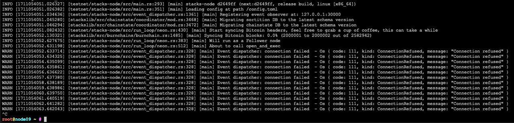

# FAQ

### Signer Setup

My signer says it is uninitialized

If you get a message like the following saying your signer is uninitialized, that means that it has not registered for the current or upcoming reward cycle (or the burnchain block height is not yet at the second block in the prepare phase) for the signer to know if it is registered.

`Signer spawned successfully. Waiting for messages to process... INFO [1711088054.872542] [stacks-signer/src/runloop.rs:278] [signer_runloop] Running one pass for signer ID# 0. Current state: Uninitialized`

At this point if you want your signer to do something you need someone to either delegate to you or you need to stack on your own for an upcoming reward cycle.

For more on this, be sure to check out the [How to Stack ](stacking-flow.md)doc.

I am trying to run my signer using Docker and it is not working correctly

Currently, for PRs, we only build for glibc x64 images. If you want to test on another architecture, you'll need to build the Docker image locally or build the binary from source as described in the [How to Run a Signer](running-a-signer.md) doc.

I'm getting an error about a missing variable

There aren't yet properly tagged releases for Nakamoto, so you'll need to make sure that you are building from the `next` branch of building from source or using the `next` tag if using the Docker image.

### Stacks Nodes

Do I need to run a Stacks node alongside a signer?

Yes, you'll need to run both a Stacks node and a signer. Set up the signer first and then set up your Stacks node following the instructions in the [How to Run a SIgner](running-a-signer.md) doc. Specifically, you'll want to run a testnet follower node.

If the instructions in the above linked guide for setting up a Stacks node are not suitable, you can follow one of the guides found in the [Nodes and Miners](../../stacks-in-depth/nodes-and-miners/) section.

When trying to run the node I am getting a connection error

First, be sure that you have the proper entry point specified in your `node-config.toml` file as specified in the [How to Run a Signer](running-a-signer.md) doc.

If you are getting an error like the following:

And you are inside a Docker container with default bridging mode, then localhost is not available, and you'll need to point to the Docker host.

### Stacking

What is stacking?

Stacking is the act of locking your STX tokens in order to help secure the network. In Nakamoto, stackers take on the additional responsibility of validating new Stacks blocks as miners propose them.

If you aren't familiar with stacking as a concept you can take a look at the [Stacking](../../stacks-101/stacking.md) doc.

As a signer, what exactly do I need to do in regards to stacking?

Because stackers also function as signers in Nakamoto, signers must either solo stack or delegate their STX tokens to a delegate.

These options and the processes for doing so are outlined in the [How to Stack](stacking-flow.md) doc, but you must do one of the two in order to operate as a signer.

How can I delegate my STX as a signer?

In order to delegate your STX tokens, you'll need to call the `delegate-stack-stx` function in the `pox-4` contract. The process for doing this can be found in the [How to Stack](stacking-flow.md) doc.

Signer public keys need to be provided when calling delegate and solo stacking functions, does this correspond to the same public key used when generating the signer signature?

Yes, the signer pubkey field always corresponds with the signer signature.

What is the .stackers boot contract?

This tracks the signers that are registered in a given reward-cycle.

Are there any changes to the overall stacking flow minus the inclusion of the signer pubkey?

No, the latest changes revolved around the signature, then about including a max-amount & auth-id with the signature.

Is there a list of 3rd party signers available?

&#x20;We have publicly announced many signers joining the network including: Blockdaemon, Figment, Kiln, Chorus One, Luganodes and[ more](https://stacks.org/new-signers-join-stacks).

Signers change every reward cycle, so do we need a way to get the new signers at each reward cycle?

That's correct, the PoX contract does a DKG event every cycle (every \~2 weeks). This is detailed in the [Nakamoto SIP](https://github.com/stacksgov/sips/blob/feat/sip-021-nakamoto/sips/sip-021/sip-021-nakamoto.md#stacker-turnover) where signers must register their keys.

