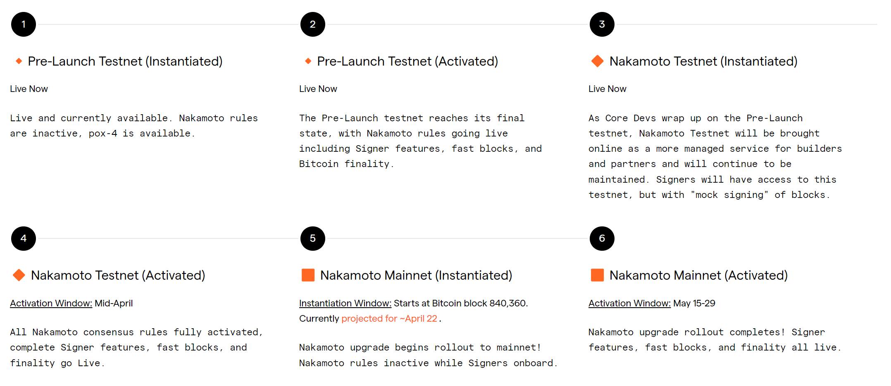

# Pre-Launch Testnet


If you have been tracking the testnet development process, this Pre-Launch Testnet refers to the release formerly known as Argon.


**Primary Usage:** Core Developers, (some) App Developers

**About:**

* This testnet will exist until the Nakamoto launch is complete and features an accelerated Stacking cycle length of <= 2 days so that core devs and builders can simulate a lot of blockchain history (and PoX cycles) in a short time.
* This testnet can run against Bitcoin Regtest or Bitcoin Testnet
* Given ongoing audits and testing, this testnet may have bugs, be reset, or run into occasional performance issues as tweaks are made.

**Status:** This testnet is currently live, stable, and producing blocks. It has moved to Step 2 (Activation), meaning that it is currently a complete testnet representation of the network with the Nakamoto rules live (except of course that it moves through blocks much faster).

**Next:** The Pre-Launch testnet will continue to undergo frequent updates and remain in flux during the activation window. On March 25th, [Nakamoto Testnet](nakamoto.md) will be brought online as a more managed service for builders and partners and will continue to be maintained.

We recommend that most developers and prospective Signers wait for the Nakamoto Testnet to come online. But if you are itching to get started now you can do so with the understanding that the testnet is currently in flux.

### Getting Started with the Pre-Launch Testnet

You can jump into the docs and code today and understand that while the testnet won’t be perfect, you’ll have an accelerated Nakamoto environment and can begin building out your applications and smart contracts.&#x20;

This will be especially helpful for any developers interacting with the new pox-4 contract. To get started on this path, here are the links and resources you may need:

#### API Endpoints

* API status: [https://api.nakamoto-1.hiro.so/extended/v1/status](https://api.nakamoto-1.hiro.so/extended/v1/status)
* Burn Block endpoint. This will allow you to get the hashes of fast Stacks blocks as they are added to the chain and see their associated burn blocks. [https://api.nakamoto-1.hiro.so/extended/v2/burn-blocks](https://api.nakamoto-1.hiro.so/extended/v2/burn-blocks)
* Pox endpoint. This allows you to get information about proof of transfer, including the currently deployed pox-4 contract. This will be helpful for anyone looking to incorporate stacking into their app. [https://api.nakamoto-1.hiro.so/v2/pox](https://api.nakamoto-1.hiro.so/v2/pox)

#### PoX-4 Contract

`pox-4.clar` is the new stacking contract for Nakamoto. If you are interested in experimenting with proof of transfer use cases including state changes, solo stacking, and pool stacking, all the functions you’ll need can be found at the deployed contract: [https://explorer.hiro.so/txid/0xecd32c2417cbdd04f655d7073876c225f7db3bd1e4427a3483cffb42d01b6a57?chain=testnet\&api=https://api.nakamoto-1.hiro.so](https://explorer.hiro.so/txid/0xecd32c2417cbdd04f655d7073876c225f7db3bd1e4427a3483cffb42d01b6a57?chain=testnet\&api=https://api.nakamoto-1.hiro.so)

Remember that the Pre-Launch Testnet has accelerated stacking cycles (2 days) to help you simulate behaviors and outcomes in your applications much faster.

#### Block Explorer

The explorer will allow you to view fast blocks as they come in. Be sure to turn on “Live updates” to see them coming in in real time. [https://explorer.hiro.so/blocks?chain=testnet\&api=https://api.nakamoto-1.hiro.so](https://explorer.hiro.so/blocks?chain=testnet\&api=https://api.nakamoto-1.hiro.so)

<figure><figcaption>
Turn on Live Updates to view blocks coming in in real time
</figcaption></figure>

#### Local Development Environment

If you are looking to start experimenting with the Pre-Launch Testnet in your local development environment, you can use this [preview version of Clarinet](https://github.com/hirosystems/clarinet/releases/tag/nakamoto-preview-1).

#### Office Hours

If you need support or just want to ask questions while experimenting with the Pre-Launch testnet, you can [join the weekly office hours](https://events.stacks.co/event/HD16484710) with the Stacks' Foundation's Developer Advocate, Kenny Rogers.

Further documentation on API endpoints and Stacks.js functions is forthcoming.
