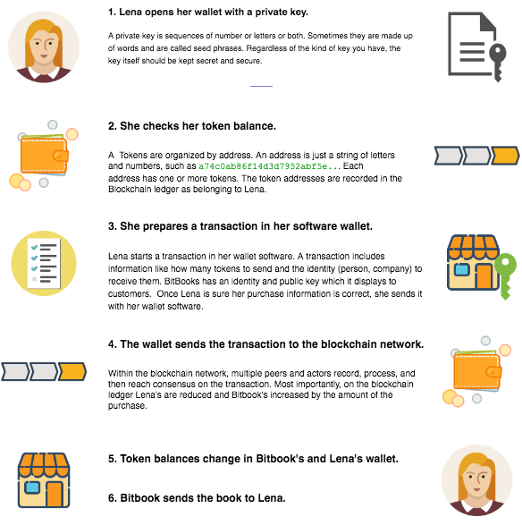

---

description: "How to use the Blockstack Software"

---
# Understand cryptocurrency wallets

If you are, or plan to be a Stacks token holder, you need to think about how you
can manage your Stacks (STX) tokens. How can you review your token balance? How can send or
receive your tokens? STX tokens are a cryptocurrency and you manage your tokens through a **cryptocurrency wallet**. This overview introduces basic wallet terminology and concepts.

* TOC
{:toc}

## Wallets, addresses, and tokens

Cryptocurrency wallets are software that make sending and receiving cryptocurrency easier. Unlike the wallets you carry physical money in, a cryptocurrency wallet doesn’t
contain your tokens. A wallet has one or more cryptocurrency addresses, in the case of Stacks these are *Stacks token address*. 

An address is public and can be viewed by other people much like your house is visible to any passerby. To open a particular address, you must know the address value and you must have the private key for that address. Wallets can read existing addresses to send from or create new addresses to send to. A wallet can show you the history of transactions for an address on the blockchain. 

Exchanging cryptocurrency requires moving currency from one address to another. Say a company, Bitbook, is selling books and receive crypto currency in payment. Lena sees a book she wants to buy on Bitbook, she selects a **Buy** button and Bitbook gives her an address to send currency to. Lena uses her private key to open one of her cryptocurrency addresses. She then sends from this address to BitBook's address. 

Token exchanges are recorded by *transactions* on a blockchain. In the case of STX, these exchanges appear on the Stacks blockchain.  The movement of tokens from Lena to Bitbook is recorded on the blockchain. The private key Lena uses is not recorded.

<h5>Security tip: What to share and what not to</h5>

A Stacks address is a string of letters and numbers starting with an <code>SP</code> or <code>SM</code>, like <code>SM3KJBA4RZ7Z20KD2HBXNSXVPCR1D3CRAV6Q05MKT</code>. You can and should share the address when you want someone to send STX tokens to you.

Your seed phrase, 24 words in an ordered sequence, is the private key for your addresses and wallet. <strong>never</strong> share your seed phrase with anyone.

## Large-scale or institutional token holders

Just as you don’t keep all the money you have in your bank in a physical wallet,
you shouldn’t keep large numbers of tokens in your cryptocurrency wallet.
Instead, if you have a large number of crypto assets, you should store them with
a custodial service. Custodial services protect your token holdings using
high-security systems.

Custodial services have different techniques for storing crypto assets.
The techniques vary according to factors such as the liquidity level you want to
maintain or the security you would like. If you own large numbers of token
assets as an investment, you should choose a custodial service as if you were
selecting any investment service. Consider your needs, the firm’s reputation,
fees, and so forth.



Blockstack suggests a firm such as [Coinbase
Custody](https://custody.coinbase.com/) for institutional holders. Coinbase
Custody charges its clients a management fee based on assets. Of course, like
any responsible asset holder, you should do your own research and select a
service that meets your needs. The Investopedia's article [What Are Cryptocurrency
Custody
Solutions?](https://www.investopedia.com/news/what-are-cryptocurrency-custody-solutions/)
is one place to start.

## Choosing a cryptocurrency wallet

You can choose among different types of cryptocurrency wallets. There are mainly
two types of wallets, software and hardware.

Software wallets run as programs on a computer desktop/tablet, online (web), or
mobile phone. Desktop software wallets are downloaded to one computer. Because
they are on one system, they are vulnerable to theft either of the computer
itself or through computer hacking. Computer viruses can also impact desktop
wallets.

Similarly, mobile, online wallets do not require a desktop, but they also tend to be smaller and simpler. Online wallets run over the web and are accessible from any networked device, computer or phone. However, online wallets are vulnerable to hacking as well and also rely on third-party service providers who themselves may also be vulnerable.

Hardware wallets store your seed and addresses on a device like a USB. To use
these wallets, you connect them to a networked computer, enter a pin, and
communicate to send and receive tokens across the web.

Unlike a pure software wallet, hardware wallets can be disconnected and placed
offline in a secure physical location like a bank deposit box. For this reason,
hardware offers another level of security that software wallets don’t have.
Blockstack suggests that you use a hardware wallet such as
[Trezor](https://trezor.io/) or [Ledger](https://www.ledger.com/).

## Multiple wallets

Of course, you need not use a software or hardware wallet exclusively, you can
use multiple wallets choosing whichever works best for you at a specific time.

For example, the Stacks Wallet is a software wallet. It operates with and
without a link to a hardware wallet. With a link to a hardware wallet, you can
use the Stacks Wallet to send and receive Stacks. When used without a hardware
wallet link, the Stacks Wallet is in _watch-only_ mode. This means the wallet
cannot send or receive Stacks. You can view only balances and transaction
history.

In some cases, you may need to transfer Stacks to a reference token address in whichever
wallet you want to move. Consult the documentation for your wallets for more
information.
